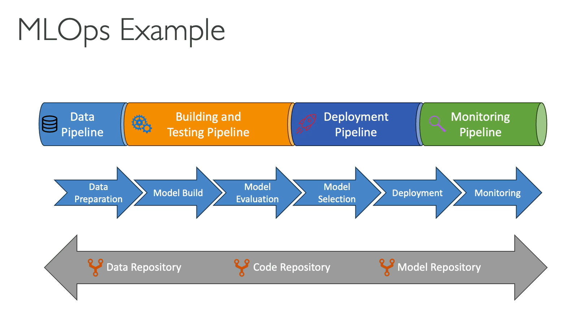

<p align="center">
  
</p>

# AWS Certified AI Practitioner (AIF-C01): Complete Study Guide

This is my full exam preparation cheat sheet for 2026. Practice it with some practice exams to finalise your preparation. Structure: exam overview → Domain 1-5 sections → service comparison tables → responsible AI breakdown → glossary → final cheat sheet.

---

## EXAM OVERVIEW

| Detail | Value |
|---|---|
| Exam code | AIF-C01 |
| Format | 65 questions (multiple choice, multiple response, ordering, matching, case study) |
| Time | 90 minutes |
| Passing score | 700 / 1000 (scaled scoring) |
| Cost | 100 USD |
| Domains | 5 |

**Domain Weighting (memorize this, it tells you where to spend study time):**

| Domain | Weight |
|---|---|
| 1. Fundamentals of AI and ML | 20% |
| 2. Fundamentals of Generative AI | 24% |
| 3. Applications of Foundation Models | 28% |
| 4. Guidelines for Responsible AI | 14% |
| 5. Security, Compliance, and Governance for AI Solutions | 14% |

**Takeaway:** Domains 2 and 3 together are over half the exam, and both are about generative AI and foundation models (Bedrock, prompt engineering, RAG, fine-tuning). Master the GenAI lifecycle and Bedrock's feature set first. Domains 4 and 5 are smaller but dense with easily memorizable facts (bias types, guardrails, governance services) that are quick points.

---

#  &nbsp;DOMAIN 1: FUNDAMENTALS OF AI AND ML (20%)

### 1.1 AI vs. ML vs. Deep Learning vs. Generative AI (nested, memorize the hierarchy)
- **Artificial Intelligence (AI)**: the broad field of building systems that perform tasks normally requiring human intelligence (reasoning, perception, language).
- **Machine Learning (ML)**: a subset of AI where models learn patterns from data instead of being explicitly programmed with rules.
- **Deep Learning (DL)**: a subset of ML using multi-layer artificial **neural networks**; excels at unstructured data (images, audio, text).
- **Generative AI (GenAI)**: a subset of deep learning that **creates new content** (text, images, audio, code) using large models trained on massive datasets.

👉 AI ⊃ ML ⊃ Deep Learning ⊃ Generative AI.

<p align="center">
  
</p>


### 1.2 Core Data and Model Terminology

| Term | Definition | Example |
|---|---|---|
| **Labeled data** | Data with known answers/tags attached (required for supervised learning) | 10,000 emails each tagged `spam` or `not spam`; photos tagged `cat` / `dog` |
| **Unlabeled data** | Raw data without tags (used in unsupervised/self-supervised learning) | A folder of 1M product reviews with no rating or category attached |
| **Structured data** | Tabular data with rows/columns (databases, CSV) | An RDS `customers` table with columns `age`, `income`, `churned` |
| **Unstructured data** | Text, images, audio, video, no predefined format | Support-call recordings, scanned PDFs, X-ray images in S3 |
| **Training data** | Data the model learns from | 70% of the housing dataset used to fit the price-prediction model |
| **Validation data** | Data used to tune hyperparameters during training | 15% held aside to compare learning rates 0.01 vs. 0.001 |
| **Test data** | Held-out data used to measure final model performance | The final 15% the model never saw, used to report 92% accuracy |
| **Features** | Input variables the model uses to make predictions | `square_footage`, `bedrooms`, `zip_code` for a house-price model |
| **Inference** | Using a trained model to make predictions on new data | Sending a new listing to a SageMaker endpoint and getting back "$412,000" |

📌 **Churn** (used in examples throughout this guide): when a customer **stops using a service** — cancels a subscription, closes an account, or simply goes inactive. **Churn prediction** is a classic **binary classification** problem (will this customer leave: yes/no?) and one of the most common real-world ML use cases, because keeping an existing customer is far cheaper than acquiring a new one.

### 1.3 Types of Machine Learning (heavily tested — know when each applies)

| Type | Data | Goal | Examples |
|---|---|---|---|
| **Supervised learning** | Labeled | Predict a known output | Classification (spam/not spam), Regression (predict house price) |
| **Unsupervised learning** | Unlabeled | Find hidden patterns/structure | Clustering (customer segmentation), Anomaly detection, Dimensionality reduction |
| **Semi-supervised learning** | Small labeled + large unlabeled | Combine both approaches | Fraud detection with few confirmed cases |
| **Reinforcement learning (RL)** | No dataset; agent + environment | Learn via trial/error to maximize a **reward** | Robotics, game playing, **AWS DeepRacer** |
| **Self-supervised learning** | Unlabeled (labels generated from data itself) | Pre-train large models | How foundation models/LLMs are pre-trained |

**Classification vs. Regression (supervised sub-types):**
- **Classification** predicts a **category/class** (yes/no, cat/dog/bird).
- **Regression** predicts a **continuous numeric value** (price, temperature, demand).

<p align="center">
  
</p>


### 1.4 Common ML Problems: Fit, Bias, and Variance

**The three base terms (know these before the problems below):**
- **Fit**: how well the model's learned pattern matches the underlying pattern in the data. A "good fit" captures the real signal without copying the noise — the two failure modes are *over*fitting and *under*fitting.
- **Bias**: error from **wrong or oversimplified assumptions** — the model is too rigid to represent reality (e.g., assuming a straight line when the truth is a curve). High bias = consistently wrong in the same direction.
- **Variance**: error from **being too sensitive to the specific training data** — small changes in the training set produce a very different model. High variance = the model chases noise.

👉 Think of a dartboard: **high bias** = all darts tightly grouped but off-center; **high variance** = darts scattered all over, even if centered on average.

**The resulting problems:**
- **Overfitting**: model memorizes training data, performs great on training but poorly on new data (**high variance**). Fix: more/diverse data, regularization, early stopping, simpler model.
  - *Example:* a loan-default model scores **99% on training data but 62% on test data** — it memorized individual applicants instead of learning general risk patterns.
- **Underfitting**: model is too simple to capture patterns, performs poorly everywhere (**high bias**). Fix: more features, more complex model, train longer.
  - *Example:* fitting a **straight line to clearly curved** sales data — **58% on training and 57% on test**; bad everywhere, not just on new data.
- **Bias-variance tradeoff**: the balancing act between the two; the goal is a model that **generalizes** to unseen data.
  - *Example:* a decision tree at depth 2 underfits, at depth 50 overfits; depth ~8 hits the sweet spot with **88% training / 86% test** — the small gap is the sign of a model that generalizes.

**Exam tip:** the giveaway is the *gap* between training and test scores. **Big gap = overfitting. Both scores low = underfitting.**

### 1.5 Model Evaluation Metrics (know which metric fits which problem)

**The metric depends on the problem type.** Classification (predicting a category) and regression (predicting a number) use completely different metrics — never mix them. An exam answer offering "RMSE" for a spam-detection question is wrong on sight.

#### Step 1: The confusion matrix (everything else is built from it)

Every classification prediction lands in one of four buckets. Pick which class is the "positive" one first (usually the rare/interesting thing: fraud, disease, churn).

|  | **Model predicts POSITIVE** | **Model predicts NEGATIVE** |
|---|---|---|
| **Actually POSITIVE** | ✅ **TP** — True Positive (correctly caught) | ❌ **FN** — False Negative (**missed it**) |
| **Actually NEGATIVE** | ❌ **FP** — False Positive (**false alarm**) | ✅ **TN** — True Negative (correctly ignored) |

- **False Positive = false alarm.** You flagged something innocent.
- **False Negative = a miss.** The real case slipped through.

👉 Which error hurts more is a *business* decision, not a math one — and that is exactly what the exam asks about.

#### Step 2: Classification metrics

Running example: **1,000 transactions, 100 of them actually fraud.** The model flags 80 as fraud, and 60 of those are real fraud.
→ **TP = 60, FP = 20, FN = 40, TN = 880**

| Metric | Formula | In plain English | Our example | Use when |
|---|---|---|---|---|
| **Accuracy** | (TP + TN) / all | Of all predictions, how many were right? | (60 + 880) / 1000 = **94%** | Classes are **balanced**. Dangerously misleading otherwise |
| **Precision** | TP / (TP + FP) | When it says "yes", how often is it right? | 60 / 80 = **75%** | **False alarms are expensive** (blocking good emails, wrongly denying loans) |
| **Recall** (Sensitivity, TPR) | TP / (TP + FN) | Of everything it should have caught, how much did it catch? | 60 / 100 = **60%** | **Misses are dangerous** (cancer screening, fraud, security threats) |
| **F1 score** | 2 × (P × R) / (P + R) | Single balanced score combining precision and recall | 2 × (.75 × .60) / 1.35 = **0.67** | You need **one number** and the data is imbalanced |
| **AUC-ROC** | Area under the TPR-vs-FPR curve | How well it separates the two classes at **any** threshold | e.g. **0.87** | Comparing models **independent of threshold**. 1.0 = perfect, 0.5 = coin flip |

**Read the example row-by-row and the lesson jumps out:** accuracy says **94%** — sounds excellent. But recall is **60%**, meaning **40 frauds walked straight through**. On imbalanced data, accuracy flatters a bad model. This is the single most-tested idea in this section.

**The precision/recall tradeoff:** they pull against each other. Lower the threshold and you flag more transactions → recall goes up, precision goes down (more false alarms). Raise it and the reverse happens. You **cannot** maximize both; you choose based on which error costs more.

#### Step 3: Regression metrics (predicting a number)

Running example: a **house-price model**, predictions off by $10k on four homes and $200k on a fifth.

| Metric | Formula | In plain English | Our example | Notes |
|---|---|---|---|---|
| **MAE** (Mean Absolute Error) | avg( \|actual − predicted\| ) | Average miss, in the original units | **$48,000** | Treats all errors equally; **robust to outliers** |
| **MSE** (Mean Squared Error) | avg( (actual − predicted)² ) | Average *squared* miss | **8.08 billion** | Units are squared (dollars²) → hard to interpret |
| **RMSE** (Root MSE) | √MSE | Squared-error penalty, back in original units | **≈ $90,000** | **Punishes large errors hard** — use when big misses are unacceptable |
| **R²** (R-squared) | 1 − (model error / baseline error) | % of the variation the model explains | e.g. **0.82** | 1.0 = perfect, 0 = no better than predicting the average |

👉 **MAE $48k vs. RMSE $90k from the same predictions.** The gap is entirely the one $200k miss — squaring it makes it dominate. **A big RMSE-vs-MAE gap means a few large errors are hiding in your model.**

#### 💡 Exam patterns to memorize

| The question says... | Example exam scenario | The answer is... |
|---|---|---|
| "Catch **every** possible case" (disease, fraud, threat) | *"A hospital screens for a rare cancer. Missing a case delays treatment; a false alarm only triggers a second test. Which metric should the team optimize?"* | **Recall** |
| "Must **never** flag a legitimate one" (spam, loan denial) | *"A bank's spam filter quarantines customer emails. Blocking a legitimate email risks losing a client. Which metric matters most?"* | **Precision** |
| "Balance both" / "data is imbalanced" | *"Only 0.2% of transactions are fraudulent. The company needs a single metric that reflects both missed fraud and false alarms."* | **F1 score** |
| "99% accuracy but the model is useless" | *"A defect-detection model reports 99% accuracy, yet the factory says it never flags a defective unit. What explains this?"* | Imbalanced data — accuracy is the wrong metric (the model just predicts the majority class) |
| "Compare models across all thresholds" | *"A team must choose between three churn models before deciding on a cutoff score. Which metric compares overall separating power?"* | **AUC-ROC** |
| "Predicting a price / amount / temperature" | *"A retailer forecasts next month's sales in dollars. Which metric evaluates the model?"* | **RMSE, MAE, or R²** (never accuracy or F1) |
| "Large errors are especially costly" | *"An energy company predicts grid demand; a single large under-forecast causes a blackout, while small misses are harmless."* | **RMSE** (over MAE) |
| "Explain how much the features account for" | *"A stakeholder asks what proportion of the variation in house prices the model actually explains."* | **R²** |
| "Show me where the model is making mistakes" | *"An analyst wants to see how many defective items were passed as good vs. how many good items were rejected."* | **Confusion matrix** |

### 1.6 The ML Development Lifecycle (ML pipeline)

The lifecycle is a **loop, not a straight line** — monitoring feeds back into retraining. Expect questions that give you an activity and ask which stage it belongs to, or which AWS service supports it.

| # | Stage | What actually happens | AWS service |
|---|---|---|---|
| 1 | **Define the business problem** | Turn a business goal into an ML question, define success in *business* terms ("cut churn 10%") **and** a model metric (recall ≥ 0.85). Decide whether ML is even the right tool | — |
| 2 | **Collect data** | Gather and centralize raw data; check you have **enough, and that it's representative** | S3 (data lake), Kinesis, Glue |
| 3 | **Prepare / clean data** | Handle missing values, remove duplicates, label data, **feature engineering** (creating and encoding the input variables), split into train/validation/test | SageMaker **Data Wrangler**, **Ground Truth** (labeling), **Feature Store** |
| 4 | **Train the model** | Choose an algorithm, feed it the training data, let it learn the patterns | SageMaker Training Jobs |
| 5 | **Evaluate** | Score the model on **held-out test data** using the metrics in 1.5; check for over/underfitting and bias | SageMaker **Clarify** (bias + explainability) |
| 6 | **Tune hyperparameters** | Adjust the settings *you* control (learning rate, tree depth, epochs) and re-evaluate against the **validation** set | SageMaker **AMT** (Automatic Model Tuning) |
| 7 | **Deploy** | Push the model to production as a real-time endpoint, batch job, or serverless (see 1.7) | SageMaker Endpoints / Batch Transform |
| 8 | **Monitor & retrain** | Watch live quality, detect **drift**, retrain when performance decays — this loops back to step 2 | SageMaker **Model Monitor**, CloudWatch |

👉 Steps 2-3 typically consume **~70-80% of the total effort**. If an exam question asks where teams spend the most time, the answer is **data preparation**.

**Parameters vs. hyperparameters (commonly confused):**
- **Parameters** are learned *by* the model during training (e.g., neural network weights). You don't set them.
- **Hyperparameters** are set *by you before* training (learning rate, number of epochs, tree depth, batch size). Tuning these is step 6.

**MLOps** = applying DevOps practices to ML: automation, CI/CD, versioning of *data and models* (not just code), reproducibility, and continuous monitoring. **SageMaker Pipelines** orchestrates the whole workflow; the **Model Registry** versions and approves models before deployment.

<p align="center">
  
</p>

**Model drift — why step 8 exists:**
- **Data drift**: the *input* data changes (new customer demographics, new product mix).
- **Concept drift**: the *relationship* between input and output changes (post-pandemic buying behavior; fraudsters inventing new tactics).
- Either way the model silently decays in production. **The fix is retraining on fresh data**, which is why the lifecycle is a loop.

**When NOT to use AI/ML** (a real exam topic — ML is not always the answer):
- Simple **deterministic rules** suffice ("flag any transaction over $10,000") — cheaper, instant, fully predictable.
- **No data, or poor-quality data** available — no amount of modeling fixes this.
- **Full interpretability is legally required** and a black-box model can't provide it.
- **Cost or latency outweighs the benefit**, or the outcome must be 100% accurate every time (ML is probabilistic by nature).

### 1.7 Inference Types

**Inference** is the act of **feeding new, unseen data into an already-trained model and getting a prediction back**. Training is when the model *learns* the patterns; inference is when it *applies* them. It is step 7 of the lifecycle (deployment) and it's where a model finally delivers business value.

**Training vs. inference — the distinction the exam leans on:**

| | **Training** | **Inference** |
|---|---|---|
| What happens | Model **learns** patterns from historical data | Model **applies** what it learned to new data |
| Frequency | Occasional (once, then periodic retraining) | Continuous — every prediction request |
| Cost profile | Expensive but short bursts | Cheaper per request, but **runs forever** → usually the larger lifetime cost |
| Example | Feeding 5 years of past transactions to learn fraud patterns | Scoring the card swipe happening right now |

👉 Because inference runs indefinitely, **choosing the right inference type is largely a cost decision**, which is exactly why AWS gives you four of them.

SageMaker offers four options, and the exam picks between them on **how fast the answer is needed, how big the payload is, and how steady the traffic is**. Listed here **fastest first**:

| Type | Latency | Endpoint / cost model | Payload & traffic | Best for |
|---|---|---|---|---|
| **Real-time inference** | **Milliseconds** — consistently the lowest | **Always-on** endpoint; you pay 24/7 whether used or not (most expensive) | Small payloads (~6 MB), **steady, predictable** traffic | Chatbots, fraud check at checkout, live product recommendations |
| **Serverless inference** | **Milliseconds — but with cold starts** after idle periods | No servers to manage; **scales to zero**, pay per request only | Small payloads, **intermittent / spiky / unpredictable** traffic | An internal tool used a few times an hour; new apps with unknown traffic |
| **Asynchronous inference** | **Seconds to minutes** — requests are **queued** | Endpoint that can **scale to zero** when the queue is empty | **Large payloads (up to ~1 GB)** and long processing times (up to ~1 hour) | Large video/image analysis, long documents — a wait is acceptable |
| **Batch transform** | **Minutes to hours** | **No persistent endpoint at all** — spins up, runs, shuts down. **Cheapest** | Entire datasets read from S3, results written back to S3 | Nightly churn scoring of all customers; monthly demand forecast |

**The tradeoff in one line:** speed costs money. Real-time is fastest and priciest because the endpoint idles at your expense; batch is slowest and cheapest because nothing runs between jobs.

**Serverless vs. real-time** — both are millisecond-class, so the deciding factor is **traffic pattern, not speed**: steady traffic → real-time; sporadic traffic where you don't want to pay for idle time → serverless (accepting occasional cold-start delay).

**Asynchronous vs. batch** — both tolerate waiting, so the deciding factor is **how requests arrive**: one large request at a time as it comes in → asynchronous; a whole dataset processed in one sweep → batch.

#### 💡 Exam patterns

| The question says... | Example exam scenario | The answer is... |
|---|---|---|
| "**Sub-second** response for users", "live", "interactive" | *"An e-commerce site must approve or decline a card transaction before the checkout page loads, with steady traffic all day. Which inference option?"* | **Real-time** |
| "Traffic is **unpredictable / intermittent**", "don't pay for idle", "no infrastructure to manage" | *"An internal HR tool classifies a handful of résumés a few times a day. The team doesn't want to pay for an idle endpoint or manage servers."* | **Serverless** |
| "**Large payloads**" or "long processing time" but a wait is fine | *"A media company submits 500 MB video files for content moderation; results are needed within the hour, not instantly."* | **Asynchronous** |
| "Score **all records** overnight", "no endpoint needed", "**lowest cost**" | *"A telecom scores its entire 10-million-row customer table for churn risk once a month and writes results back to S3 at the lowest possible cost."* | **Batch transform** |
| "Cold start is acceptable" | *"A startup is launching a new feature with unknown demand and can tolerate a short delay on the first request after an idle period."* | **Serverless** (this phrase is the giveaway) |
| "Steady, **predictable** traffic" + low latency | *"A support chatbot serves a constant ~200 requests per second and must reply instantly."* | **Real-time** (serverless would add cold starts) |
| Request **exceeds the size or timeout limit** of a real-time endpoint | *"A team's real-time endpoint fails on 200 MB inputs that take 12 minutes to process. What should they switch to?"* | **Asynchronous** (real-time caps at ~6 MB / 60s) |

###  &nbsp;1.8 Amazon SageMaker AI (the build-it-yourself ML platform)

| Feature | Purpose | Lifecycle stage |
|---|---|---|
| **SageMaker Studio** | Web-based IDE for the whole ML lifecycle — notebooks, experiments, training, and deployment in one browser workspace, so nothing runs on a laptop | All |
|  &nbsp;**SageMaker Ground Truth** | Data **labeling**: sends raw data to human labelers (your team, a vendor, or Mechanical Turk) and uses **active learning** to auto-label the easy items, cutting labeling cost. This is how you create the labeled data supervised learning requires | 3. Prepare |
| **SageMaker Data Wrangler** | Visual, **low-code data preparation** — import from S3/Redshift/Athena, spot missing values and outliers, apply 300+ built-in transformations, and do **feature engineering** without writing pandas code | 3. Prepare |
| **SageMaker Feature Store** | Central repository to **store, share, and reuse features** across teams and models. Prevents **training/serving skew** by guaranteeing training and inference use the identical feature definitions | 3. Prepare |
| **SageMaker Autopilot / Canvas** | **AutoML** — hand it a tabular dataset and a target column; it automatically tries algorithms and hyperparameters and ranks the resulting models. **Canvas** is the **no-code, point-and-click** front end aimed at business analysts who don't write code | 4-6. Train/Tune |
| **SageMaker JumpStart** | A hub of **pre-trained models and ready-made solution templates** (including foundation models) you can deploy or fine-tune in a few clicks instead of training from scratch | 4. Train / 7. Deploy |
| **SageMaker Clarify** | Two jobs: **detects bias** in the data *before* training and in the model *after* training, and provides **explainability** (which features drove a prediction, via feature attribution). The go-to answer for "explain the model" or "check for unfair treatment" | 5. Evaluate |
| **SageMaker Model Monitor** | Continuously watches a **deployed** endpoint for **data drift, model-quality decay, and bias drift**, comparing live traffic against a training baseline and alerting via CloudWatch when it degrades | 8. Monitor |
| **SageMaker Pipelines** | **CI/CD orchestration for ML (MLOps)** — chains prepare → train → evaluate → deploy into a repeatable, automated, version-tracked workflow that can be re-run on new data | All (automation) |
| **SageMaker Model Cards** | **Governance documentation** for a model: intended use, risk rating, training data, evaluation results, and limitations — recorded in one auditable place for regulators and reviewers | Governance |
| **SageMaker Model Registry** | **Catalog and version control** for trained models, with an **approval workflow** so only reviewed model versions get promoted to production | 7. Deploy |

### 1.9 Pre-trained AWS AI Services (no ML expertise needed — heavily tested "pick the right service" questions)

| Service | Capability | Example (think of it as...) |
|---|---|---|
|  &nbsp;**Amazon Rekognition** | Image and video analysis: **object and scene detection**, facial analysis and face comparison, celebrity recognition, **content moderation** (nudity/violence), and text-in-image. Works on both stored files and live video streams | **Google Photos** recognizing your friends' faces, or **Instagram** auto-blurring graphic content. *Use case:* a dating app auto-rejecting inappropriate profile pictures |
|  &nbsp;**Amazon Textract** | Extracts text, handwriting, **tables, and form key-value pairs** from scanned documents — going beyond plain OCR by preserving *structure*, so "Name: John" comes back as a labeled field, not loose text | **Adobe Scan** or a banking app's **check-deposit-by-photo**. *Use case:* an insurer auto-reading 10,000 scanned claim forms into a database |
|  &nbsp;**Amazon Comprehend** | NLP over text: **sentiment** (positive/negative/neutral/mixed), entity extraction (people, places, dates), key phrases, language detection, topic modeling, and **PII detection/redaction** | The engine behind a **Trustpilot-style review dashboard** saying "78% positive". *Use case:* scanning support tickets to flag angry customers for escalation |
|  &nbsp;**Amazon Transcribe** | **Speech-to-text** (audio → text) with speaker identification (diarization), timestamps, custom vocabularies for jargon, and automatic PII redaction | **Otter.ai**, **Zoom live captions**, or **YouTube auto-subtitles**. *Use case:* transcribing call-center recordings so they can be searched and analyzed |
|  &nbsp;**Amazon Polly** | **Text-to-speech** (text → lifelike audio) in dozens of languages and voices, with **neural voices** and SSML control over pronunciation, pauses, and emphasis | The voice of **Alexa**, **Google Maps navigation**, or an audiobook narrator. *Use case:* a news site offering a "listen to this article" button |
|  &nbsp;**Amazon Translate** | Neural machine **translation** between 75+ languages, with custom terminology so brand names and product terms stay untranslated | **Google Translate** / **DeepL**. *Use case:* an e-commerce site instantly localizing product listings into 12 languages |
|  &nbsp;**Amazon Lex** | Builds conversational **chatbots and voice bots** using **intents** (what the user wants) and **slots** (the details needed) — the same speech + language engine that powers Alexa | **Alexa** or the automated phone menu that says *"Tell me why you're calling."* *Use case:* a bank bot handling "check my balance" and "reset my PIN" without an agent |
|  &nbsp;**Amazon Kendra** | Intelligent **enterprise search**: ask a natural-language question and get a specific answer (not a link list) from internal SharePoint, S3, Confluence, and databases — respecting each user's permissions | **Google search, but only over your company's internal documents**. *Use case:* an employee asking "how many vacation days do I get after 5 years?" and getting the exact HR-policy sentence |
|  &nbsp;**Amazon Personalize** | Real-time personalized **recommendations** and re-ranked search results from your user-interaction history — the same technology behind Amazon.com's "customers also bought" | **Netflix's "Because you watched..."** or **Spotify Discover Weekly**. *Use case:* a streaming service tailoring its homepage per viewer |
|  &nbsp;**Amazon Forecast** | **Time-series forecasting** for future numeric values, combining your history with related factors like price, promotions, weather, and holidays | The system telling a supermarket **how much milk to stock next Tuesday**. *Use case:* predicting energy demand or retail inventory per store |
|  &nbsp;**Amazon Fraud Detector** | Detects online **fraud** — fake account creation, payment fraud, promo/coupon abuse — scoring events in real time using your data plus 20+ years of Amazon fraud expertise | Your **bank texting "was this you?"** seconds after a suspicious purchase. *Use case:* blocking bots creating thousands of fake free-trial accounts |
|  &nbsp;**Amazon Comprehend Medical** | **HIPAA-eligible** NLP for clinical text: extracts medications, dosages, diagnoses, symptoms, and test results from doctors' notes, and links them to standard medical codes (ICD-10, RxNorm) | A **digital medical scribe** reading a doctor's messy notes and filling in the chart. *Use case:* turning free-text physician notes into structured billing codes |
|  &nbsp;**Amazon Augmented AI (A2I)** | Adds a **human-in-the-loop** review step: predictions below a confidence threshold are automatically routed to a person to verify, and the corrections can feed back into training | The **"we couldn't read this — a human will check it"** step in a deposit or ID-verification app. *Use case:* routing blurry scanned checks to a reviewer instead of guessing |
|  &nbsp;**AWS DeepRacer** | A 1/18-scale autonomous race car (plus a 3D simulator and racing league) for **learning reinforcement learning** hands-on by designing reward functions | A **video game for learning RL** — trial, error, and reward, like teaching a dog tricks with treats. *Use case:* educational only; never the answer to a production question |

**The three-layer AWS AI stack (know where each service sits):**
1. **AI Services** (top, easiest): Rekognition, Comprehend, Translate, etc. — pre-trained APIs, no ML knowledge needed.
2. **ML Platform** (middle): SageMaker AI — build, train, and deploy your own models.
3. **Infrastructure** (bottom): EC2 GPU instances (P5, G6), **AWS Trainium** (training chips), **AWS Inferentia** (inference chips).

---

#  &nbsp;DOMAIN 2: FUNDAMENTALS OF GENERATIVE AI (24%)

### 2.1 Core GenAI Concepts (memorize these definitions)

Domain 2 assumes this vocabulary in every question, so learn it first. The concepts are grouped below by what they describe: **the models**, **how text is represented**, and **how a request is structured**.

#### A. The models themselves

| Concept | Definition | In plain English / Example |
|---|---|---|
| **Foundation Model (FM)** | A very large model **pre-trained on broad, unlabeled data** (self-supervised) that can be adapted to many different downstream tasks without retraining from scratch | A **university graduate**: broadly educated, then quickly trained for a specific job. One FM can summarize, translate, and write code — older ML needed a separate model per task |
| **Large Language Model (LLM)** | A foundation model specialized in understanding and generating **text** | Claude, Amazon Nova, Llama. **All LLMs are FMs, but not all FMs are LLMs** (image models are FMs too) |
| **Transformer** | The neural-network **architecture** behind modern LLMs. Its **self-attention** mechanism weighs the relationship between *all* tokens at once rather than reading strictly left-to-right | Reading the whole sentence before deciding what "it" refers to. Processing tokens in **parallel** is what made training at this scale possible |
| **Diffusion model** | The architecture behind **image generators**: starts from pure noise and **iteratively removes it** until an image matching the prompt emerges | Sculpting a statue out of static. Used by Stable Diffusion and Amazon Titan/Nova image models |
| **Unimodal model** | Works with a **single** data type | Text in → text out |
| **Multimodal model** | Accepts and/or produces **multiple** data types | Upload a photo of your fridge and ask "what can I cook?" — image + text in, text out |

#### B. How text is represented

| Concept | Definition | In plain English / Example |
|---|---|---|
| **Token** | The basic unit of text a model processes — roughly a word fragment. Models don't see letters or words, only tokens, and **you are billed per token (input + output)** | "unbelievable" might split into `un` + `believ` + `able`. **Rule of thumb: 1 token ≈ 4 characters ≈ ¾ of a word**, so 1,000 tokens ≈ 750 words |
| **Embedding** | A numeric **vector** representation of text or images that captures **semantic meaning**, so similar meanings sit close together in vector space | "king" and "queen" land near each other; "king" and "banana" don't. This is what lets search match **meaning instead of exact keywords** |
| **Vector database** | Stores embeddings and retrieves the most **semantically similar** items to a query | The searchable memory behind **RAG** (see 3.2). AWS options: OpenSearch Serverless, Aurora pgvector, Neptune Analytics |

👉 **Tokens vs. embeddings** (easy to confuse): a **token** is a *chunk of text*; an **embedding** is a *list of numbers representing meaning*. Tokenizing splits the text up; embedding turns it into coordinates.

#### C. Structuring a request

| Concept | Definition | In plain English / Example |
|---|---|---|
| **Prompt** | The input or instruction given to the model | *"Summarize this contract in 3 bullet points."* Quality of prompt drives quality of output — hence prompt engineering |
| **Completion / Response** | The model's generated output | The 3 bullet points that come back |
| **Context window** | The **maximum tokens a model can consider in one request — prompt *and* response combined**. It is the model's short-term memory and it does **not** persist between calls | A 200K-token window fits a ~500-page book. Exceed it and the request fails or the earliest content is dropped — a common cause of a chatbot "forgetting" the start of a long conversation |

**Cost and limits both run on tokens**, which is why the exam keeps returning to them: longer prompts mean higher cost, higher latency, and a greater risk of hitting the context window.

### 2.2 How LLMs Generate Text

#### The core mechanic: one token at a time

An LLM does **not** plan a whole answer. It repeatedly predicts the **next most likely token**, appends it to the text, and feeds the result back in as the new input. This loop is called **autoregressive generation**.

```
"The weather today is" → [model] → "sunny"
"The weather today is sunny" → [model] → " and"
"The weather today is sunny and" → [model] → " warm"   ... and so on
```

At each step the model produces a **probability distribution over every possible next token**:

| Candidate token | Probability |
|---|---|
| "sunny" | 40% |
| "cloudy" | 25% |
| "rainy" | 20% |
| "windy" | 10% |
| "purple" | 5% |

**Inference parameters decide how that list gets turned into an actual choice.** Always picking the top token would make output repetitive and robotic, so the model *samples* — and that sampling is what you control.

👉 This also explains two things the exam tests: **why LLMs are non-deterministic** (sampling means the same prompt can give different answers), and **why they hallucinate** (the model optimizes for *plausible next token*, not *true statement* — it has no fact-checking step).

#### The inference parameters

| Parameter | What it controls | How it works | Typical values |
|---|---|---|---|
| **Temperature** | **Randomness / creativity** | Reshapes the probability distribution. **Low (→0)** sharpens it — the top token dominates, output is focused and near-deterministic. **High (→1+)** flattens it, giving unlikely tokens ("purple") a real chance | **0-0.3** factual Q&A, extraction, code · **0.7-1.0** brainstorming, marketing copy |
| **Top-k** | **How many candidates** are eligible | Keeps only the **k most likely** tokens and samples from those. A fixed-size shortlist | `k=3` → only "sunny", "cloudy", "rainy" can be chosen |
| **Top-p** (nucleus sampling) | **How much probability mass** is eligible | Adds tokens from most to least likely until their probabilities reach **p**, then samples from that set. The shortlist **resizes itself** based on model confidence | `p=0.85` → "sunny" + "cloudy" + "rainy" (0.40+0.25+0.20). `p=0.5` → just "sunny" + "cloudy" |
| **Max tokens** | **Response length** | Hard cap on tokens generated. Also a **direct cost and latency control** | Set it deliberately — output tokens are billed |
| **Stop sequences** | **Where to stop** | Generation halts immediately if the model produces one of these strings | `"\n\nHuman:"` to stop a chat turn running on |

**Top-k vs. top-p** — both trim the candidate list, but top-k is a fixed count while top-p adapts: when the model is confident (one token at 95%), top-p narrows to almost nothing; when it's unsure (many similar options), top-p widens. **Guidance: tune temperature *or* top-p, not both** — stacking them makes behavior hard to reason about.

**Generation stops when** one of three things happens: max tokens is reached, a stop sequence appears, or the model emits its own end-of-sequence token.

#### 💡 Exam patterns

| The question says... | Example exam scenario | The answer is... | Why |
|---|---|---|---|
| "Consistent, **repeatable**, factual answers" | *"A bank's assistant answers policy questions. Two employees asking the same question must get the same answer."* | **Lower the temperature** (toward 0) | Sharpens the distribution so the top token wins nearly every time |
| "More **creative / diverse / varied** output" | *"A marketing team complains the model produces the same bland slogan every time and wants more variety."* | **Raise the temperature** (0.7-1.0) | Flattens the distribution so lower-probability tokens get chosen |
| "Responses are **too long** / cost is too high" | *"A summarization feature returns multi-page answers, driving up per-request cost."* | **Reduce max tokens** | Output tokens are billed; this is the direct cost lever |
| "Model **keeps generating past** where it should" | *"A chatbot answers, then invents the user's next question and answers that too."* | **Add a stop sequence** | Halts generation the moment that string appears |
| "Restrict to a **fixed number** of candidate words" | *"A team wants the model to only ever consider its 10 most likely next words."* | **Top-k** | Fixed-size shortlist, regardless of confidence |
| "Restrict by **probability mass** / adapt to confidence" | *"A team wants a narrow candidate set when the model is confident but a wider one when it isn't."* | **Top-p** (nucleus sampling) | The shortlist resizes itself with the distribution |
| "Same prompt gives **different answers** each time" | *"A QA tester files a bug: identical prompts return different wording on each run."* | Not a bug — LLMs are **non-deterministic**; lower temperature to reduce it | Output is *sampled* from a distribution, not looked up |
| "The model states **false facts confidently**" | *"An assistant cites a court case that doesn't exist."* | **Hallucination** — lower temperature helps slightly; the real fix is **RAG** (see 3.2) | The model predicts plausible tokens, not verified truth |
| Answer choices offer **both** temperature and top-p tuning | *"Which single change increases response diversity?"* | Adjust **one**, not both | Stacking them makes behavior unpredictable — standard AWS guidance |
| "Reduce **latency** of responses" | *"A voice assistant's replies take too long to start speaking."* | **Reduce max tokens** (and prompt length) | Fewer tokens generated = less time; latency scales with output length |

### 2.3 GenAI Use Cases and Limitations
**Use cases:** text generation/summarization, chatbots and virtual assistants, code generation, image/video/audio generation, translation, search, recommendation, data augmentation.

**Limitations (know all of these):**
- **Hallucinations**: confidently generating false/fabricated information.
- **Knowledge cutoff**: no awareness of events after training data ends (mitigate with RAG).
- **Non-determinism**: same prompt can yield different outputs.
- **Bias/toxicity**: inherited from training data.
- **Lack of interpretability**: hard to explain why an output was produced.
- **Prompt injection risk**: malicious inputs can manipulate behavior.
- **Cost/latency**: bigger models = better quality but slower and more expensive.

### 2.4 The Foundation Model Lifecycle
1. **Data selection** → 2. **Pre-training** (self-supervised, massive unlabeled data, extremely expensive) → 3. **Fine-tuning** (adapt to specific tasks/domains with labeled data) → 4. **Alignment** (RLHF — Reinforcement Learning from Human Feedback — to make outputs helpful/harmless) → 5. **Evaluation** → 6. **Deployment** → 7. **Feedback/monitoring**.

### 2.5 Model Customization Approaches (ordered by cost/complexity — VERY heavily tested)

A foundation model arrives knowing a great deal about the world in general and **nothing about your company in particular**. **Customization** is how you close that gap. The exam almost never asks "what is fine-tuning?" — it describes a business situation and asks **which of the five approaches fits**, so the skill being tested is picking the *cheapest* approach that actually solves the stated problem.

👉 **The golden rule: always start at the top of the ladder and only climb when the rung below genuinely cannot do the job.** If two options both work, the exam wants the cheaper/simpler one. Prompt engineering and RAG solve the large majority of real scenarios.

| # | Approach | What it is | Data needed | Cost / effort | Time to value | Changes model weights? |
|---|---|---|---|---|---|---|
| 1 | **Prompt engineering** | Craft better instructions, context, and examples **inside the prompt** (zero-/few-shot, chain-of-thought, role setting) | None — just well-written text | Cheapest, essentially free | Minutes | ❌ No |
| 2 | **RAG (Retrieval-Augmented Generation)** | Retrieve relevant documents from a knowledge base (**vector DB**) at query time and inject them into the prompt as context | Your documents (**unlabeled**, no training pairs) | Low–moderate (embedding + vector store + retrieval infra) | Days | ❌ No |
| 3 | **Fine-tuning** | Further train the FM on your **labeled** prompt→response examples so it internalizes a task, tone, or format | Hundreds–thousands of **labeled** examples | High (labeled data + GPU compute + Provisioned Throughput to serve) | Weeks | ✅ Yes (private copy) |
| 4 | **Continued pre-training** (a.k.a. domain adaptation) | Keep pre-training the FM on a large body of **unlabeled** domain text so it absorbs specialized vocabulary and style | Large volumes of raw **unlabeled** domain text | Higher still | Weeks–months | ✅ Yes (private copy) |
| 5 | **Training from scratch** | Build your own foundation model from zero | Internet-scale data | Extreme — millions of dollars, months, a research team | Months–years | ✅ (an entirely new model) |

**The tradeoff in one line:** cost, effort, and required expertise climb steeply as you go down the table, while flexibility to change the model's *inherent behavior* climbs with it. Almost every exam answer is rung 1, 2, or 3 — rung 5 is nearly always a distractor.

#### The three distinctions that decide most questions

**A. RAG vs. fine-tuning — the single most tested comparison.** They fix *different* problems, so "which is better" is never the real question; "what is broken" is.

| | **RAG** | **Fine-tuning** |
|---|---|---|
| Fixes | The model **doesn't know the facts** (missing, private, or out-of-date knowledge) | The model **doesn't behave the way you want** (wrong tone, format, or task skill) |
| Knowledge freshness | **Real-time** — update the document store and the next answer reflects it | **Frozen** at training time — new facts require retraining |
| Hallucinations | **Reduces** them by grounding answers in retrieved source text | Does **not** fix them; can even increase confidence in wrong answers |
| Citations / traceability | ✅ Can cite the source document | ❌ No source to point to |
| Access control | Respects per-document permissions at retrieval time | ❌ Training data is baked in for everyone |
| Cost shape | Ongoing retrieval + **longer prompts** (more input tokens per call) | Big upfront training cost, then **shorter prompts** per call |

👉 Memory hook: **RAG = an open-book exam** (the model looks facts up). **Fine-tuning = studying for the exam** (the model changes what it knows how to do). And they are **not mutually exclusive** — "improve accuracy *and* adopt our house style" legitimately means **both**.

**B. Fine-tuning vs. continued pre-training — decided by the data you have.**
- **Labeled pairs** (prompt + ideal response, e.g., a support ticket and the approved reply) → **fine-tuning** (also called *instruction tuning* when the pairs are instructions).
- **Raw unlabeled domain text** (a decade of legal filings, medical journals, internal wikis) → **continued pre-training**, to teach vocabulary and domain style rather than a specific task.
- The giveaway word in the question is almost always **"labeled"** or **"unlabeled."**

**C. Prompt engineering vs. everything else — decided by whether the knowledge fits in the prompt.** If the needed context is small and stable (a style guide, a handful of examples, a fixed policy), paste it into the prompt. If it's a large, growing, or frequently changing corpus that can't fit in the context window, you need **RAG**.

#### Supporting concepts the exam name-drops

- **PEFT (Parameter-Efficient Fine-Tuning) / LoRA** — fine-tunes only a small set of added parameters instead of all of them. **Far cheaper and faster** than full fine-tuning with most of the benefit; the answer when a question stresses "fine-tune **on a limited budget**."
- **Instruction tuning** — fine-tuning specifically on instruction→response pairs to make a model follow directions better.
- **RLHF (Reinforcement Learning from Human Feedback)** — uses **human preference rankings** to align outputs with human values (helpful, honest, harmless). The keyword is **human feedback/preferences**, not labeled examples.
- **Model distillation** — trains a **smaller, cheaper, faster "student" model** to imitate a large "teacher" model. The answer when a question wants **lower inference cost/latency** while preserving quality.
- **In Amazon Bedrock:** fine-tuning and continued pre-training both produce a **private copy** of the model (your data never trains the base model), and serving a customized model **requires Provisioned Throughput** — a real recurring cost that makes customization meaningfully more expensive than RAG. **Bedrock Knowledge Bases** is the managed way to do RAG; **Bedrock Model Customization** is the managed way to fine-tune.

#### 💡 Exam patterns

| The question says... | Example exam scenario | The answer is... |
|---|---|---|
| "Latest **internal documents**", "updated **daily**", "must cite sources", "avoid retraining" | *"A firm wants its assistant to answer from policy documents that change every day, with a link to the source paragraph."* | **RAG** (retraining daily is impractical) |
| Model "**makes up** answers", "needs to be **grounded** in company data" | *"Support bot invents refund policies that don't exist. What reduces hallucinations most directly?"* | **RAG** (grounding in retrieved text) |
| "Adopt our **brand voice / specific format / tone**", "consistently respond as a X specialist" | *"Outputs must always follow the company's structured incident-report format."* | **Fine-tuning** (behavior, not facts) |
| "We have **thousands of labeled** example question/answer pairs" | *"A team has 5,000 past tickets with approved responses and wants the model to reply the same way."* | **Fine-tuning** (labeled pairs = the tell) |
| "Large volume of **unlabeled** domain text", "master medical/legal **terminology**" | *"A hospital has 10 years of unlabeled clinical notes and wants the model to understand its jargon."* | **Continued pre-training** |
| "Fine-tune but **minimize cost / limited compute**" | *"A startup wants a customized model but can't afford full fine-tuning."* | **PEFT / LoRA** |
| "Align outputs with **human preferences / values**", "reviewers rank responses" | *"Human reviewers rank pairs of responses and the model is updated to prefer the better ones."* | **RLHF** |
| "**Reduce inference cost and latency** while keeping quality" | *"A production model is too slow and expensive; they want a smaller model with similar accuracy."* | **Model distillation** (or simply choosing a smaller FM) |
| "**Quickest / cheapest / no infrastructure**", "improve output with **no data**" | *"A team must improve summary quality this afternoon with no budget."* | **Prompt engineering** (always try this rung first) |
| Only **a few examples** are available to steer the model | *"They have 3 sample outputs showing the desired format."* | **Few-shot prompting**, not fine-tuning (too little data to train on) |
| "Needs both **accurate current data** and **domain-specific tone**" | *"Answers must reflect this week's inventory and sound like our brand."* | **RAG + fine-tuning** (they're complementary) |
| "Build our **own foundation model**", huge budget, no existing FM fits | *"A research lab needs a model for a language no FM supports."* | **Training from scratch** — but treat it as a **distractor** unless the question is explicit |
| "Customized model in Bedrock must be **served in production**" | *"What's required to run a fine-tuned Bedrock model?"* | **Provisioned Throughput** |

###  &nbsp;2.6 Amazon Bedrock (the GenAI centerpiece of this exam)

Bedrock is a **fully managed, serverless** service that offers foundation models from **multiple providers through a single API**. You never provision a GPU, patch a server, or manage an endpoint — you call an API, and AWS runs the model. It is the default correct answer whenever a scenario says "build a GenAI application on AWS."

**Why "single API" matters:** swapping from one provider's model to another is a change of the model ID in your request, not a rewrite of your application. That is the flexibility argument the exam rewards.

**The privacy guarantee (memorize this — it appears verbatim in questions):** your prompts and data are **NOT used to train the base models**, are **not shared with the model provider**, and **stay inside your AWS account/Region**. Traffic can stay off the public internet via **VPC endpoints (AWS PrivateLink)**, data is encrypted with **KMS**, and access is controlled by **IAM**.

**Model providers available (know that it's multi-vendor, not just Amazon):**

| Provider | Models | Typically known for |
|---|---|---|
| **Amazon** | **Nova**, Titan | Amazon's own family — text, image, video, and **embeddings**; strong price-performance |
| **Anthropic** | **Claude** | Long context windows, reasoning, high-quality text |
| **Meta** | **Llama** | Open-weight models |
| **Mistral AI** | Mistral, Mixtral | Efficient, low-cost models |
| **Cohere** | Command, Embed | Text generation and **embeddings** |
| **Stability AI** | Stable Diffusion | **Image generation** |
| **AI21 Labs** | Jamba / Jurassic | Long-form text |

#### Bedrock features (each one is a likely exam answer)

| Bedrock feature | Purpose | The scenario that points to it |
|---|---|---|
| **Model catalog / Playground** | Compare and experiment with FMs in the console before committing | "Evaluate several models side by side without writing code" |
| **Knowledge Bases** | Fully managed **RAG**: point it at your data (e.g., S3) and Bedrock handles **chunking, embeddings, vector storage, retrieval, and citations** | "Answer from our internal documents with the least development effort" |
| **Agents** | **Multi-step task automation**: the FM plans the steps, calls APIs/**Lambda** functions (*action groups*), consults Knowledge Bases, and completes the task | "Not just answer — actually book the appointment / process the return" |
| **Guardrails** | Configurable safety layer: **denied topics**, harmful-content filters, **word filters**, **PII redaction/masking**, and **contextual grounding checks** to catch hallucinations. Applies to **both the prompt and the response**, and works across models | Anything about blocking, filtering, redacting, or enforcing safety policy consistently |
| **Model customization** | **Fine-tuning** (labeled data) and **continued pre-training** (unlabeled data), producing a **private copy** of the model | See §2.5 — customization ladder rungs 3 and 4 |
| **Model evaluation** | **Automatic** evaluation (built-in metrics/datasets) or **human** evaluation (your own team or an AWS-managed work team) for subjective qualities | "Compare models for accuracy" → automatic; "judge tone/brand friendliness/helpfulness" → **human** |
| **Provisioned Throughput** | Reserved capacity purchased in **model units** for guaranteed throughput — and **required to serve a customized (fine-tuned or continued-pre-trained) model** | "Predictable high volume" or "how do we run our fine-tuned model in production?" |
| **Watermark detection** | Detects whether an image was generated by Amazon **Titan/Nova** image models | "Verify whether this image was AI-generated" |
| **Bedrock Studio / PartyRock** | Low- and no-code environments for building and sharing GenAI apps | "Let non-developers prototype" |

#### Bedrock pricing modes

| Mode | How you pay | Use when |
|---|---|---|
| **On-Demand** | Per **input and output token** (or per image), **no commitment** | Variable, unpredictable, or exploratory workloads — the default |
| **Batch** | Bulk asynchronous processing at a **discount** (roughly half of on-demand) | Large jobs where results aren't needed immediately |
| **Provisioned Throughput** | **Hourly commitment** (1- or 6-month terms) for guaranteed capacity | Steady high volume, latency guarantees, or **any custom model** |

👉 **The cost lever the exam loves:** you pay per **token**, and **input tokens count too**. That is why stuffing huge context into every prompt (or a poorly tuned RAG retrieval) raises cost — and why a **smaller model** is often the right answer to "reduce cost/latency."

#### 💡 Exam patterns

| The question says... | The answer is... |
|---|---|
| "Access **multiple providers'** models through **one API**", "avoid vendor lock-in" | **Amazon Bedrock** |
| "**Serverless**, no infrastructure to manage" for GenAI | **Bedrock** (SageMaker means you manage infrastructure) |
| "Will our data be used to **train the model**?" | **No** — Bedrock does not use your data to train base models |
| "Keep Bedrock traffic **off the public internet**" | **VPC endpoints / PrivateLink** |
| "Managed **RAG** with the least effort" | **Bedrock Knowledge Bases** (not a hand-built vector DB) |
| "Model must **take actions** / call APIs / complete a multi-step task" | **Bedrock Agents** |
| "**Block** certain topics, **redact PII**, filter harmful content" | **Bedrock Guardrails** |
| "Detect when the model's answer **isn't supported by the source**" | **Guardrails contextual grounding checks** |
| "Compare models on **subjective** quality like tone or brand fit" | **Bedrock Model Evaluation — human evaluation** |
| "**Guaranteed capacity**" or "run our **fine-tuned** model" | **Provisioned Throughput** |
| "Large volume of prompts, results **not needed immediately**, lowest cost" | **Batch** inference mode |
| "Is this image **AI-generated**?" | **Watermark detection** |

### 2.7 Other AWS GenAI Services

The exam's recurring trap here is offering **Bedrock** when the scenario actually describes a **ready-made** product. If the company wants a working assistant rather than a platform to build one, the answer is **Amazon Q**.

| Service | Purpose | Think of it as... |
|---|---|---|
|  &nbsp;**Amazon Q Business** | Ready-to-use GenAI **assistant for employees**: connects to company data via **40+ built-in connectors** (SharePoint, Salesforce, Confluence, S3, Slack…) and answers with **citations**. Critically, it is **permission-aware** — each user only sees answers drawn from documents they're already allowed to read | A search-and-answer assistant over the company intranet, with no building required |
|  &nbsp;**Amazon Q Apps** | Lets employees turn a **plain-English description** into a small shareable internal app, built on Q Business | "Describe the tool you want" → a working internal app |
|  &nbsp;**Amazon Q Developer** | GenAI **coding assistant** (formerly **CodeWhisperer**): code generation and completion in the IDE, code explanation, **security vulnerability scanning**, unit-test and documentation generation, plus AWS expertise and cost/resource questions in the console | A pair programmer that also knows your AWS account |
|  &nbsp;**Amazon Nova / Titan** | Amazon's own **foundation models** — text, image, video, and **embeddings** — available in Bedrock. **Titan Embeddings** is the usual answer for converting text to vectors for a vector database | Amazon's in-house model family |
| **PartyRock** | **Free, no-code** Bedrock playground for building and sharing GenAI apps; requires no AWS account | A sandbox for learning and prototyping, not production |
|  &nbsp;**Amazon Kendra** | **Intelligent enterprise search** using natural-language queries over connected repositories; frequently used as the **retrieval layer** in a custom RAG architecture | Enterprise search that returns answers, not just links |
|  &nbsp;**Amazon A2I (Augmented AI)** | Routes **low-confidence predictions to human reviewers**, building a human-in-the-loop workflow | The "escalate to a person when the model isn't sure" answer |
|  &nbsp;**SageMaker JumpStart** | Deploy or fine-tune **pre-trained models and FMs** inside SageMaker, where **you control the hosting infrastructure** | Bedrock's alternative when you need infrastructure-level control |

#### The abstraction ladder (classic exam question)

| Level | Service | You supply | You get | Expertise needed |
|---|---|---|---|---|
| Highest abstraction | **Amazon Q** | Your data connectors | A **finished assistant** — no building | Lowest — business users |
| Middle | **Amazon Bedrock** | Prompts and API calls | **Managed FMs** to build your own app on | Moderate — developers |
| Lowest abstraction | **SageMaker AI** | Data, code, model choice, infrastructure decisions | **Full control** to train, tune, and host models | Highest — ML practitioners |

👉 **Decide by what the company wants to own.** "We want an assistant" → **Q**. "We want to build an application" → **Bedrock**. "We need our own model, our own training, our own endpoints" → **SageMaker AI**. The cheapest and fastest option that satisfies the requirement is always the intended answer.

#### 💡 Exam patterns

| The question says... | The answer is... |
|---|---|
| "**Employees** ask questions about internal company documents", "least effort", "**respect existing permissions**" | **Amazon Q Business** |
| "Help **developers write code**", "scan code for **security vulnerabilities**" | **Amazon Q Developer** |
| "Convert text into **vectors/embeddings** for a vector store" | **Amazon Titan Embeddings** (via Bedrock) |
| "**No-code**, free, just experimenting / learning" | **PartyRock** |
| "**Natural-language enterprise search** across repositories" | **Amazon Kendra** |
| "Send **low-confidence** results to a **human reviewer**" | **Amazon A2I** |
| "Deploy a pre-trained FM but **control the hosting infrastructure**" | **SageMaker JumpStart** (not Bedrock) |
| "Business users need a **custom internal app** from a description" | **Amazon Q Apps** |

### 2.8 Advantages of AWS for GenAI

This section is easy points: the questions are usually "which AWS benefit addresses this concern?" Map each concern to its advantage.

| Advantage | What it means | The concern it answers |
|---|---|---|
| **Security and privacy by default** | Your prompts and outputs are **not used to train base models**, stay in your account and Region, and are protected by **IAM, KMS encryption, and PrivateLink** | "Will our confidential data leak or train someone else's model?" |
| **Choice of models** | Multiple providers behind **one Bedrock API**, so you can pick the best model per task and switch later | "How do we avoid **vendor lock-in** and pick the right model?" |
| **Lower barrier to entry** | Managed and pre-trained services mean **no ML PhD, no GPU cluster, no model training** required | "We have no ML expertise" |
| **Speed to market** | Knowledge Bases, Agents, and Guardrails replace months of custom RAG/safety plumbing | "We need a prototype in production quickly" |
| **Pay-as-you-go economics** | Per-token on-demand pricing with no upfront commitment; commit only when volume is predictable | "We can't justify a large upfront investment" |
| **Scalability and reliability** | Serverless scaling across AWS's global Regions and Availability Zones | "Can it handle our traffic spikes?" |
| **Integration with existing AWS services** | Native fit with S3, Lambda, CloudWatch, CloudTrail, IAM, and SageMaker | "It must work with what we already run on AWS" |
| **Responsible AI tooling built in** | **Guardrails**, **Model Evaluation**, **SageMaker Clarify**, **Model Cards**, and **AI Service Cards** | "How do we prove this is safe, fair, and governed?" |
| **Purpose-built silicon** | **AWS Trainium** (training) and **AWS Inferentia** (inference) chips deliver better **price-performance** than general-purpose GPUs; **AWS Neuron** is the SDK for them | "How do we cut training/inference cost?" |

👉 **Memory hook for the chips:** **Train**ium → **training**. **Infer**entia → **inference**. That one-letter mnemonic is worth a free point.

---

#  &nbsp;DOMAIN 3: APPLICATIONS OF FOUNDATION MODELS (28%, largest weight)

### 3.1 Criteria for Selecting a Foundation Model
- **Modality**: text, image, multimodal, embeddings?
- **Model size / capability**: bigger ≈ more capable but slower and pricier.
- **Context window size**: how much text must fit in one request?
- **Latency and cost** requirements (per-token pricing).
- **Customization options**: does it support fine-tuning?
- **Language/domain coverage**, licensing, and provider terms.
- **Benchmark performance** on your actual task (always evaluate on your own data).

### 3.2 Retrieval-Augmented Generation (RAG) — know this flow cold
1. Your documents are split into **chunks** → 2. an **embeddings model** converts chunks to vectors → 3. vectors are stored in a **vector database** → 4. a user's question is embedded and **semantically similar chunks are retrieved** → 5. retrieved context + question are sent to the LLM → 6. the LLM answers **grounded in your data**, reducing hallucinations, with no retraining.

**AWS vector database options (recognize these):** Amazon OpenSearch Service (with vector engine), Amazon Aurora PostgreSQL / RDS for PostgreSQL (**pgvector**), Amazon Neptune (graph + vectors), Amazon DocumentDB, Amazon MemoryDB, Amazon S3 Vectors.

### 3.3 Prompt Engineering Techniques (heavily tested)

| Technique | Description |
|---|---|
| **Zero-shot prompting** | Ask the task directly with **no examples** |
| **Few-shot prompting** | Include a **few worked examples** in the prompt to show the desired pattern |
| **One-shot prompting** | Exactly one example |
| **Chain-of-thought (CoT)** | Ask the model to reason **step by step** (improves math/logic tasks); e.g., add "think step by step" |
| **Prompt templates** | Reusable prompt structures with variables filled at runtime |
| **Negative prompting** | Explicitly state what the model should NOT do/include |

**Anatomy of a good prompt:** instruction (the task) + context (background info) + input data + output format indicator (e.g., "respond in JSON").

**Prompt attacks (know the difference):**
- **Prompt injection**: attacker embeds malicious instructions in input to override the system prompt.
- **Jailbreaking**: crafting prompts to bypass the model's safety guardrails.
- **Prompt leaking**: tricking the model into revealing its hidden system prompt or sensitive context.
- Mitigations: Bedrock **Guardrails**, input validation, least-privilege agent permissions.

### 3.4 Fine-Tuning in Practice
- Requires a **labeled dataset** of prompt-completion pairs (instruction tuning).
- **Domain adaptation fine-tuning**: adapt to industry vocabulary (via continued pre-training on unlabeled domain text).
- **RLHF**: humans rank outputs; a reward model teaches the FM human preferences (alignment).
- In Bedrock, fine-tuning creates a **private copy** of the model, served via Provisioned Throughput.
- Risk: **catastrophic forgetting**, fine-tuning too narrowly can degrade general capabilities.

### 3.5 Evaluating Foundation Model Performance

| Method/Metric | Used for |
|---|---|
| **ROUGE** | Evaluating **summarization** (overlap with reference summaries) |
| **BLEU** | Evaluating **translation** quality |
| **BERTScore** | Semantic similarity between generated and reference text |
| **Perplexity** | How well a model predicts text (lower = better) |
| **Benchmarks (MMLU, HELM, GLUE…)** | Standardized general-capability comparisons |
| **Human evaluation** | Gold standard for subjective quality (fluency, helpfulness, brand tone) |
| **Business metrics** | Ultimately what matters: user satisfaction, conversion rate, cost per interaction |

👉 Remember the pairing: **ROUGE = summaRization, BLEU = translation (Bilingual)**.

### 3.6 Agents and Multi-Step Applications
- **Agents** extend FMs beyond text generation: they break a goal into steps, call **tools/APIs/Lambda functions**, retrieve knowledge, and act (e.g., "book a flight and email the itinerary").
- **Bedrock Agents** handle orchestration, session memory, and action groups (OpenAPI-defined actions) for you.

### 3.7 GenAI Application Architecture (typical exam scenario)
User → application front end → **Amazon Bedrock** (FM + Guardrails) → **Knowledge Base** (RAG over S3 documents, embeddings in a vector store) → optional **Agent** actions via Lambda → responses logged to CloudWatch, API calls audited by CloudTrail.

---

#  &nbsp;DOMAIN 4: GUIDELINES FOR RESPONSIBLE AI (14%)

### 4.1 Core Dimensions of Responsible AI (memorize the list)
1. **Fairness**: no discrimination against individuals/groups.
2. **Explainability**: humans can understand why a model made a decision.
3. **Transparency**: openness about how the system works, its capabilities and limits.
4. **Privacy and security**: protect personal data throughout the lifecycle.
5. **Robustness / veracity**: model works reliably, even on unexpected inputs.
6. **Governance**: policies and accountability for AI development/use.
7. **Safety / controllability**: prevent harmful outputs; ability to steer and monitor system behavior.

### 4.2 Bias, Fairness, and Dataset Quality
- **Bias** enters through **unrepresentative training data**, historical/societal bias in data, labeling bias, and measurement error.
- **Fairness practices**: use **diverse, balanced, representative datasets**; audit outcomes across demographic groups; keep humans in the loop for high-stakes decisions.
- **Class imbalance**: one class dominates the training data → model performs poorly on the minority class.
- Legal/reputational consequences of biased AI: discrimination lawsuits, regulatory penalties, customer trust loss.

### 4.3 Explainability and Transparency Tools

| Tool | Purpose |
|---|---|
| **SageMaker Clarify** | Detects statistical **bias** in datasets and models; generates **explainability** reports (feature importance / SHAP values) |
| **SageMaker Model Cards** | Document a model's purpose, training data, metrics, risk rating, and intended/unintended uses |
| **AWS AI Service Cards** | AWS-published responsible-AI documentation for its own AI services (intended use cases, limitations, design choices) |
| **SageMaker Model Monitor** | Detects data drift/quality degradation in production |
|  &nbsp;**Amazon A2I** | Routes low-confidence predictions to **human reviewers** (human-in-the-loop) |
| **Bedrock Guardrails** | Blocks harmful content, denied topics, PII exposure; contextual grounding checks against hallucination |
| **Bedrock Model Evaluation** | Compare models on quality AND responsible-AI dimensions (toxicity, robustness) |

**Interpretability vs. explainability:** interpretable models (linear regression, **decision trees**) are transparent by design; complex models (neural networks) need post-hoc **explainability** techniques. Tradeoff: interpretability ↔ performance.

### 4.4 Responsible Model/Data Choices
- Prefer the **simplest model that meets the need** (also cheaper and more explainable).
- Check **licensing and data provenance** of models and training data.
- Watch for these GenAI-specific harms: **hallucination** (false output), **toxicity** (harmful output), **intellectual property infringement** (regurgitating copyrighted training data), **misinformation/deepfakes**, and **plagiarism/cheating**.
- **Human-centered design**: human oversight for consequential decisions, clear disclosure that users are interacting with AI, feedback mechanisms.

---

#  &nbsp;DOMAIN 5: SECURITY, COMPLIANCE, AND GOVERNANCE FOR AI (14%)

### 5.1 Securing AI Systems with AWS Services (mostly reused from core AWS security — easy points)

| Service | Role in AI workloads |
|---|---|
|  &nbsp;**IAM** | Least-privilege access to models, training data, endpoints; roles for SageMaker/Bedrock |
|  &nbsp;**AWS KMS** | Encrypt training data, model artifacts, and endpoints at rest |
|  &nbsp;**Amazon Macie** | Discover **PII/sensitive data** in S3 before it enters training/RAG pipelines |
|  &nbsp;**AWS PrivateLink / VPC endpoints** | Access Bedrock/SageMaker **without traversing the public internet** |
|  &nbsp;**AWS CloudTrail** | Audit **who called which model API, when** |
|  &nbsp;**Amazon CloudWatch** | Monitor model invocation metrics, latency, and logs |
|  &nbsp;**AWS Secrets Manager** | Store API keys/credentials used by AI applications |
|  &nbsp;**Amazon GuardDuty** | Threat detection across the account hosting AI workloads |

**Shared Responsibility Model still applies:** AWS secures the infrastructure and (for Bedrock) the model-serving environment; **you** are responsible for your data, prompts, access control, and how outputs are used.

### 5.2 Data Governance for AI
- **Data lineage/provenance**: document where training data came from and how it was transformed.
- **Data quality**: curate, clean, deduplicate; garbage in → garbage out.
- **Data residency/sovereignty**: keep data in required Regions (Bedrock processes data in-Region).
- **Retention and deletion policies**; secure the **entire lifecycle**: collect → store (encrypt) → process → share → archive/delete.
-  &nbsp;**AWS Glue / Glue Data Quality / DataZone / Lake Formation**: catalog, quality-check, govern, and control access to data lakes feeding AI.

### 5.3 Compliance and Governance Services

| Service | Purpose |
|---|---|
|  &nbsp;**AWS Artifact** | Download AWS compliance reports (SOC, ISO, PCI, HIPAA BAA) |
|  &nbsp;**AWS Config** | Track resource configuration compliance over time |
|  &nbsp;**AWS Audit Manager** | Continuously collect evidence against compliance frameworks (has a **generative AI best-practices framework**) |
|  &nbsp;**AWS Trusted Advisor** | Best-practice checks (cost, security, fault tolerance) |
|  &nbsp;**Amazon Inspector** | Vulnerability scanning of compute running AI apps |

**Regulated-workload awareness:** know that AI systems may fall under **GDPR** (EU data protection, right to explanation), **HIPAA** (health data), and the **EU AI Act** (risk-based AI regulation); algorithmic accountability laws increasingly require bias audits.

### 5.4 GenAI-Specific Security Concerns
- **Prompt injection / jailbreaking** (see 3.3) → Guardrails + input sanitization.
- **Data poisoning**: attacker corrupts training data to skew the model.
- **Model inversion / membership inference**: extracting training data from a model.
- **Exposure of PII** in prompts or outputs → Guardrails PII redaction, Macie on data stores.
- **Hallucination risk in production** → RAG grounding, contextual grounding checks, human review (A2I).
- **OWASP Top 10 for LLMs** exists; recognize the name.

### 5.5 The Generative AI Security Scoping Matrix (recognize the five scopes)
| Scope | Description | Example |
|---|---|---|
| **Scope 1** | Consumer app | Public chatbot (ChatGPT web) |
| **Scope 2** | Enterprise app | SaaS with GenAI features (Amazon Q in Connect) |
| **Scope 3** | Pre-trained models | Building on Bedrock FMs as-is |
| **Scope 4** | Fine-tuned models | Bedrock/SageMaker fine-tuning on your data |
| **Scope 5** | Self-trained models | Training your own FM from scratch |

👉 Higher scope number = more control AND more security responsibility for you.

---

## CRITICAL SERVICE COMPARISON CHEAT SHEET

| Comparison | Key Distinction |
|---|---|
| AI vs. ML vs. DL vs. GenAI | Nested subsets: AI ⊃ ML ⊃ Deep Learning ⊃ GenAI |
| Supervised vs. Unsupervised vs. RL | Supervised = labeled data, predict outputs. Unsupervised = unlabeled, find patterns. RL = agent maximizes reward via trial/error |
| Classification vs. Regression | Classification = predict a category. Regression = predict a number |
| Overfitting vs. Underfitting | Overfitting = great on training, bad on new data (high variance). Underfitting = bad everywhere (high bias) |
| Precision vs. Recall | Precision = minimize false positives. Recall = minimize false negatives (catch everything) |
| Bedrock vs. SageMaker AI vs. Amazon Q | Bedrock = build GenAI apps on managed FMs (API). SageMaker = build/train/deploy your own ML models. Q = ready-to-use assistant, no building |
| Q Business vs. Q Developer | Q Business = employee assistant over company data. Q Developer = coding assistant (ex-CodeWhisperer) |
| Prompt engineering vs. RAG vs. Fine-tuning | Prompting = cheapest, no data change. RAG = inject fresh external knowledge, no weight change. Fine-tuning = retrain weights on labeled data for style/domain behavior |
| RAG vs. Fine-tuning (when?) | Frequently changing/proprietary knowledge → RAG. Consistent style, domain vocabulary, task specialization → fine-tuning |
| Knowledge Bases vs. Agents vs. Guardrails (Bedrock) | Knowledge Bases = managed RAG. Agents = multi-step actions/API calls. Guardrails = content safety filters/PII redaction |
| Textract vs. Rekognition | Textract = extract text/tables/forms from documents. Rekognition = analyze images/videos (objects, faces, moderation) |
| Transcribe vs. Polly vs. Translate | Transcribe = speech→text. Polly = text→speech. Translate = language→language |
| Comprehend vs. Kendra | Comprehend = extract meaning from text (sentiment, entities, PII). Kendra = natural-language enterprise search |
| Lex vs. Q Business | Lex = build task-oriented chatbots (intents/slots). Q Business = GenAI answers over enterprise content |
| Personalize vs. Forecast | Personalize = recommendations for users. Forecast = time-series predictions |
| SageMaker Clarify vs. Model Monitor vs. A2I | Clarify = bias detection + explainability. Model Monitor = production drift detection. A2I = human review of predictions |
| Ground Truth vs. Data Wrangler vs. Feature Store | Ground Truth = labeling. Data Wrangler = visual data prep. Feature Store = store/share features |
| JumpStart vs. Bedrock | JumpStart = deploy pre-trained models into YOUR SageMaker environment (you manage infra). Bedrock = serverless FM API (AWS manages infra) |
| Trainium vs. Inferentia | Trainium = custom chip for **training**. Inferentia = custom chip for **inference** |
| ROUGE vs. BLEU | ROUGE = summarization quality. BLEU = translation quality |
| Temperature vs. Top-p/Top-k | Temperature = randomness dial. Top-p/Top-k = restrict the candidate token pool |
| On-Demand vs. Provisioned Throughput (Bedrock) | On-Demand = pay per token, spiky/low volume. Provisioned = hourly commitment, high volume + required for fine-tuned models |
| Interpretability vs. Explainability | Interpretable = transparent by design (decision trees). Explainable = post-hoc explanation of a black box (SHAP/Clarify) |

---

## KNOW YOUR INITIALISMS

| Initialism | Full Name | Notes |
|------------|-----------|-------|
| A2I | Amazon Augmented AI | Human review of ML predictions |
| AI | Artificial Intelligence | The broad field |
| AUC | Area Under the Curve | Classification metric (ROC curve) |
| BLEU | Bilingual Evaluation Understudy | Translation quality metric |
| CoT | Chain of Thought | Step-by-step reasoning prompting |
| CV | Computer Vision | Image/video understanding |
| DL | Deep Learning | Neural networks with many layers |
| EPOCH | (not an acronym) | One full pass through the training dataset |
| F1 | F1 Score | Harmonic mean of precision and recall |
| FM | Foundation Model | Large pre-trained adaptable model |
| GenAI | Generative AI | AI that creates new content |
| GPU | Graphics Processing Unit | Parallel hardware for training/inference |
| LLM | Large Language Model | Text-focused foundation model |
| MAE | Mean Absolute Error | Regression metric |
| ML | Machine Learning | Learning patterns from data |
| MLOps | Machine Learning Operations | CI/CD + monitoring for ML systems |
| MSE | Mean Squared Error | Regression metric |
| NLP | Natural Language Processing | Understanding/generating human language |
| OCR | Optical Character Recognition | Text extraction from images (Textract goes beyond it) |
| PII | Personally Identifiable Information | Detect with Comprehend/Macie; redact with Guardrails |
| RAG | Retrieval-Augmented Generation | Ground FM answers in your own data |
| RL | Reinforcement Learning | Reward-driven learning (DeepRacer) |
| RLHF | Reinforcement Learning from Human Feedback | Aligning FMs with human preferences |
| RMSE | Root Mean Squared Error | Regression metric |
| ROC | Receiver Operating Characteristic | Classification threshold curve |
| ROUGE | Recall-Oriented Understudy for Gisting Evaluation | Summarization quality metric |
| SHAP | SHapley Additive exPlanations | Feature-importance explainability (used by Clarify) |

### Quick Memory Tips

- **Transcribe = ears** (speech→text), **Polly = mouth** (text→speech, "Polly the parrot talks").
- **ROUGE = summaRization**, **BLEU = Bilingual (translation)**.
- **Precision = don't cry wolf** (few false alarms), **Recall = leave no one behind** (miss nothing).
- **Trainium trains, Inferentia infers.**
- **Temperature up = creativity up.**
- Customization cost ladder: **Prompting < RAG < Fine-tuning < Continued pre-training < From scratch.**
- The AWS AI stack top-down: **Q (use it) → Bedrock (build with FMs) → SageMaker (build your own) → chips (run it).**

---

## GLOSSARY OF MUST-KNOW TERMS

- **Agent**: GenAI system that plans multi-step tasks and calls tools/APIs to complete them.
- **Alignment**: tuning a model to behave according to human values/preferences (via RLHF).
- **Chunking**: splitting documents into pieces before embedding them for RAG.
- **Context window**: maximum tokens a model can process in one request.
- **Data drift**: production input data diverging from training data over time, degrading accuracy.
- **Embedding**: numeric vector capturing the semantic meaning of text/images.
- **Epoch**: one complete pass through the training dataset.
- **Explainability**: ability to explain why a model produced a given output.
- **Foundation model**: large pre-trained model adaptable to many tasks.
- **Grounding**: tying model responses to verified source data (RAG) to reduce hallucination.
- **Hallucination**: model confidently generating false information.
- **Hyperparameters**: training configuration set before training (learning rate, epochs, batch size).
- **Inference**: using a trained model to generate predictions/outputs.
- **Latent space**: internal compressed representation a model uses to encode concepts.
- **Model parameters/weights**: values learned during training that define the model.
- **Prompt injection**: attack that embeds malicious instructions in model input.
- **Responsible AI**: fairness, explainability, transparency, privacy, robustness, governance, safety.
- **Token**: unit of text an LLM reads/writes and the unit you're billed by.
- **Transformer**: self-attention architecture behind modern LLMs.
- **Vector database**: stores embeddings for fast semantic-similarity search.

---
