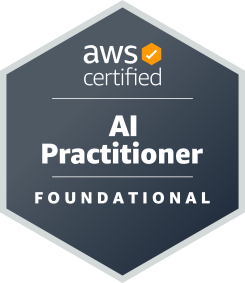
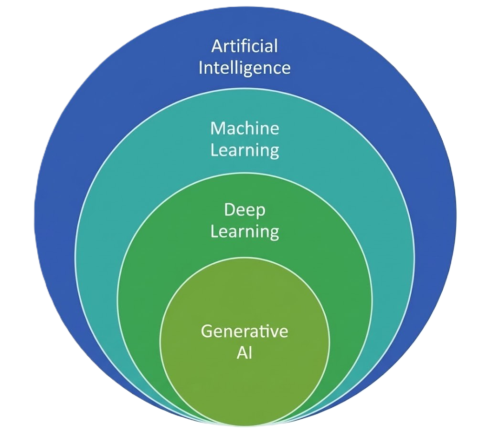
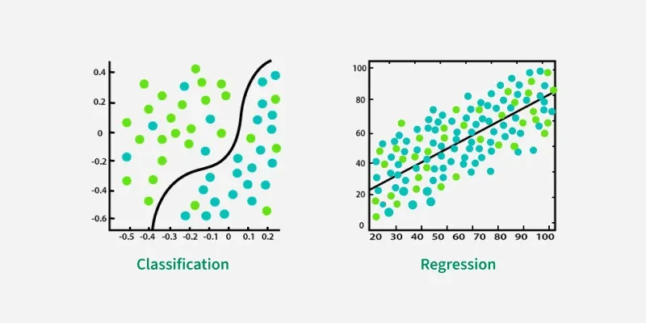

  

# AWS Certified AI Practitioner (AIF-C01): Complete Study Guide

This is my full exam preparation cheat sheet for 2026. Practice it with some practice exams to finalise your preparation. Structure: exam overview → Domain 1-5 sections → service comparison tables → responsible AI breakdown → glossary → final cheat sheet.

---

## EXAM OVERVIEW

| Detail | Value |
|---|---|
| Exam code | AIF-C01 |
| Format | 65 questions (multiple choice, multiple response, ordering, matching, case study) |
| Time | 90 minutes |
| Passing score | 700 / 1000 (scaled scoring) |
| Cost | 100 USD |
| Domains | 5 |

**Domain Weighting (memorize this, it tells you where to spend study time):**

| Domain | Weight |
|---|---|
| 1. Fundamentals of AI and ML | 20% |
| 2. Fundamentals of Generative AI | 24% |
| 3. Applications of Foundation Models | 28% |
| 4. Guidelines for Responsible AI | 14% |
| 5. Security, Compliance, and Governance for AI Solutions | 14% |

**Takeaway:** Domains 2 and 3 together are over half the exam, and both are about generative AI and foundation models (Bedrock, prompt engineering, RAG, fine-tuning). Master the GenAI lifecycle and Bedrock's feature set first. Domains 4 and 5 are smaller but dense with easily memorizable facts (bias types, guardrails, governance services) that are quick points.

---

#  &nbsp;DOMAIN 1: FUNDAMENTALS OF AI AND ML (20%)

### 1.1 AI vs. ML vs. Deep Learning vs. Generative AI (nested, memorize the hierarchy)
- **Artificial Intelligence (AI)**: the broad field of building systems that perform tasks normally requiring human intelligence (reasoning, perception, language).
- **Machine Learning (ML)**: a subset of AI where models learn patterns from data instead of being explicitly programmed with rules.
- **Deep Learning (DL)**: a subset of ML using multi-layer artificial **neural networks**; excels at unstructured data (images, audio, text).
- **Generative AI (GenAI)**: a subset of deep learning that **creates new content** (text, images, audio, code) using large models trained on massive datasets.

👉 AI ⊃ ML ⊃ Deep Learning ⊃ Generative AI.

  

### 1.2 Core Data and Model Terminology

| Term | Definition | Example |
|---|---|---|
| **Labeled data** | Data with known answers/tags attached (required for supervised learning) | 10,000 emails each tagged `spam` or `not spam`; photos tagged `cat` / `dog` |
| **Unlabeled data** | Raw data without tags (used in unsupervised/self-supervised learning) | A folder of 1M product reviews with no rating or category attached |
| **Structured data** | Tabular data with rows/columns (databases, CSV) | An RDS `customers` table with columns `age`, `income`, `churned` |
| **Unstructured data** | Text, images, audio, video, no predefined format | Support-call recordings, scanned PDFs, X-ray images in S3 |
| **Training data** | Data the model learns from | 70% of the housing dataset used to fit the price-prediction model |
| **Validation data** | Data used to tune hyperparameters during training | 15% held aside to compare learning rates 0.01 vs. 0.001 |
| **Test data** | Held-out data used to measure final model performance | The final 15% the model never saw, used to report 92% accuracy |
| **Features** | Input variables the model uses to make predictions | `square_footage`, `bedrooms`, `zip_code` for a house-price model |
| **Inference** | Using a trained model to make predictions on new data | Sending a new listing to a SageMaker endpoint and getting back "$412,000" |

### 1.3 Types of Machine Learning (heavily tested — know when each applies)

| Type | Data | Goal | Examples |
|---|---|---|---|
| **Supervised learning** | Labeled | Predict a known output | Classification (spam/not spam), Regression (predict house price) |
| **Unsupervised learning** | Unlabeled | Find hidden patterns/structure | Clustering (customer segmentation), Anomaly detection, Dimensionality reduction |
| **Semi-supervised learning** | Small labeled + large unlabeled | Combine both approaches | Fraud detection with few confirmed cases |
| **Reinforcement learning (RL)** | No dataset; agent + environment | Learn via trial/error to maximize a **reward** | Robotics, game playing, **AWS DeepRacer** |
| **Self-supervised learning** | Unlabeled (labels generated from data itself) | Pre-train large models | How foundation models/LLMs are pre-trained |

**Classification vs. Regression (supervised sub-types):**
- **Classification** predicts a **category/class** (yes/no, cat/dog/bird).
- **Regression** predicts a **continuous numeric value** (price, temperature, demand).

  

### 1.4 Common ML Problems: Fit, Bias, and Variance

**The three base terms (know these before the problems below):**
- **Fit**: how well the model's learned pattern matches the underlying pattern in the data. A "good fit" captures the real signal without copying the noise — the two failure modes are *over*fitting and *under*fitting.
- **Bias**: error from **wrong or oversimplified assumptions** — the model is too rigid to represent reality (e.g., assuming a straight line when the truth is a curve). High bias = consistently wrong in the same direction.
- **Variance**: error from **being too sensitive to the specific training data** — small changes in the training set produce a very different model. High variance = the model chases noise.

👉 Think of a dartboard: **high bias** = all darts tightly grouped but off-center; **high variance** = darts scattered all over, even if centered on average.

**The resulting problems:**
- **Overfitting**: model memorizes training data, performs great on training but poorly on new data (**high variance**). Fix: more/diverse data, regularization, early stopping, simpler model.
  - *Example:* a loan-default model scores **99% on training data but 62% on test data** — it memorized individual applicants instead of learning general risk patterns.
- **Underfitting**: model is too simple to capture patterns, performs poorly everywhere (**high bias**). Fix: more features, more complex model, train longer.
  - *Example:* fitting a **straight line to clearly curved** sales data — **58% on training and 57% on test**; bad everywhere, not just on new data.
- **Bias-variance tradeoff**: the balancing act between the two; the goal is a model that **generalizes** to unseen data.
  - *Example:* a decision tree at depth 2 underfits, at depth 50 overfits; depth ~8 hits the sweet spot with **88% training / 86% test** — the small gap is the sign of a model that generalizes.

**Exam tip:** the giveaway is the *gap* between training and test scores. **Big gap = overfitting. Both scores low = underfitting.**

### 1.5 Model Evaluation Metrics (know which metric fits which problem)

| Metric | Problem type | Meaning | Example |
|---|---|---|---|
| **Accuracy** | Classification | % of all predictions that were correct (misleading on imbalanced data) | 90 correct out of 100 emails = 90%. But if only 1% of transactions are fraud, always predicting "not fraud" scores 99% and catches nothing |
| **Precision** | Classification | Of predicted positives, how many were actually positive (minimize **false positives**) | Spam filter flags 100 emails, 95 really are spam → precision 95%. The 5 legit emails sent to junk are the cost |
| **Recall** | Classification | Of actual positives, how many were caught (minimize **false negatives**, e.g., medical screening) | 200 patients have the disease, the screen catches 180 → recall 90%. The 20 missed cases are the cost |
| **F1 score** | Classification | Harmonic mean of precision and recall (balanced view on imbalanced data) | Precision 0.90 + recall 0.50 → F1 ≈ 0.64 (a plain average would flatter it at 0.70) |
| **AUC-ROC** | Classification | Ability to distinguish classes across thresholds (1.0 = perfect, 0.5 = random) | A churn model scoring AUC 0.87 ranks a random churner above a random non-churner 87% of the time |
| **Confusion matrix** | Classification | Table of true/false positives/negatives | 1,000 loan applications → 850 TN, 90 TP, 40 FP (wrongly denied), 20 FN (bad loans approved) |
| **MAE / MSE / RMSE** | Regression | Average size of prediction errors (lower = better) | House-price model with RMSE of $18,000 is off by roughly $18k per home; MSE/RMSE punish a single $200k miss far harder than MAE |
| **R² (R-squared)** | Regression | How much variance the model explains | R² = 0.82 → the features explain 82% of the variation in sales; the other 18% is unexplained |

### 💡Note:
A classic exam pattern: "A hospital wants to catch every possible case of a disease" → optimize **recall**. "A spam filter must never block a legitimate email" → optimize **precision**.

### 1.6 The ML Development Lifecycle (ML pipeline)
1. **Define the business problem** (and whether ML is even appropriate)
2. **Collect data** → 3. **Prepare/clean data** (feature engineering, labeling)
4. **Train the model** → 5. **Evaluate** (metrics above)
6. **Tune hyperparameters** → 7. **Deploy** (real-time endpoint or batch)
8. **Monitor** (drift detection, retraining) — this is **MLOps**.

**When NOT to use AI/ML:** simple deterministic rules suffice, no/poor-quality data available, full interpretability legally required, or cost outweighs benefit.

### 1.7 Inference Types

| Type | Latency | Use case |
|---|---|---|
| **Real-time inference** | Milliseconds, persistent endpoint | Chatbots, fraud checks at checkout |
| **Batch inference** | Minutes-hours, no persistent endpoint | Nightly scoring of a whole dataset (cheapest for bulk) |
| **Asynchronous inference** | Near real-time, queued | Large payloads with tolerable wait |
| **Serverless inference** | On-demand, scales to zero | Intermittent/unpredictable traffic |

###  &nbsp;1.8 Amazon SageMaker AI (the build-it-yourself ML platform)

| Feature | Purpose |
|---|---|
| **SageMaker Studio** | Web-based IDE for the whole ML lifecycle |
|  &nbsp;**SageMaker Ground Truth** | Data **labeling** service (human workforce + automated labeling) |
| **SageMaker Data Wrangler** | Visual data preparation/feature engineering |
| **SageMaker Feature Store** | Central repository for storing/sharing ML features |
| **SageMaker Autopilot / Canvas** | AutoML; Canvas = **no-code** ML for business analysts |
| **SageMaker JumpStart** | Hub of pre-trained models and solutions (including foundation models) to deploy quickly |
| **SageMaker Clarify** | Detects **bias** in data/models and explains predictions (explainability) |
| **SageMaker Model Monitor** | Monitors deployed models for data/model **drift** |
| **SageMaker Pipelines** | CI/CD workflow orchestration for ML (MLOps) |
| **SageMaker Model Cards** | Documentation of a model's intended use, risk rating, and training details (governance) |
| **SageMaker Model Registry** | Catalog and version control for trained models |

### 1.9 Pre-trained AWS AI Services (no ML expertise needed — heavily tested "pick the right service" questions)

| Service | Capability |
|---|---|
|  &nbsp;**Amazon Rekognition** | Image/video analysis: object detection, facial analysis, content moderation, text-in-image |
|  &nbsp;**Amazon Textract** | Extract text, handwriting, tables, and form data from scanned **documents** (beyond simple OCR) |
|  &nbsp;**Amazon Comprehend** | NLP: sentiment analysis, entity extraction, key phrases, PII detection, language detection |
|  &nbsp;**Amazon Transcribe** | **Speech-to-text** (audio → text), supports custom vocabularies |
|  &nbsp;**Amazon Polly** | **Text-to-speech** (text → lifelike audio) |
|  &nbsp;**Amazon Translate** | Neural machine **translation** between languages |
|  &nbsp;**Amazon Lex** | Build conversational **chatbots**/voice bots (the tech behind Alexa) |
|  &nbsp;**Amazon Kendra** | Intelligent **enterprise search** across internal documents using natural language |
|  &nbsp;**Amazon Personalize** | Real-time personalized **recommendations** (same tech as Amazon.com) |
|  &nbsp;**Amazon Forecast** | Time-series **forecasting** (demand, inventory) |
|  &nbsp;**Amazon Fraud Detector** | Detect online **fraud** (fake accounts, payment fraud) |
|  &nbsp;**Amazon Comprehend Medical** | Extract medical information from unstructured clinical text |
|  &nbsp;**Amazon Augmented AI (A2I)** | Adds **human review** workflows for low-confidence ML predictions |
|  &nbsp;**AWS DeepRacer** | 1/18-scale race car for learning **reinforcement learning** |

**The three-layer AWS AI stack (know where each service sits):**
1. **AI Services** (top, easiest): Rekognition, Comprehend, Translate, etc. — pre-trained APIs, no ML knowledge needed.
2. **ML Platform** (middle): SageMaker AI — build, train, and deploy your own models.
3. **Infrastructure** (bottom): EC2 GPU instances (P5, G6), **AWS Trainium** (training chips), **AWS Inferentia** (inference chips).

---

#  &nbsp;DOMAIN 2: FUNDAMENTALS OF GENERATIVE AI (24%)

### 2.1 Core GenAI Concepts (memorize these definitions)

| Concept | Definition |
|---|---|
| **Foundation Model (FM)** | Very large model pre-trained on broad data, adaptable to many downstream tasks |
| **Large Language Model (LLM)** | A foundation model specialized in understanding/generating **text** |
| **Token** | The basic unit of text an LLM processes (~a word fragment; you're billed per token) |
| **Embedding** | A numeric **vector** representation of text/images that captures semantic meaning; similar meanings → nearby vectors |
| **Vector database** | Stores embeddings and finds semantically similar items (powers RAG search) |
| **Transformer** | The neural network architecture behind modern LLMs; uses **self-attention** to weigh relationships between all tokens at once |
| **Context window** | Maximum number of tokens a model can consider in one request (prompt + response) |
| **Prompt** | The input/instruction given to a model |
| **Completion / Response** | The model's generated output |
| **Multimodal model** | Handles multiple data types (e.g., text + images in, text out) |
| **Diffusion model** | Architecture behind image generators; iteratively removes noise to create images (e.g., Stable Diffusion, Amazon Titan/Nova image models) |
| **Unimodal model** | Works with a single data type (text in, text out) |

### 2.2 How LLMs Generate Text
LLMs predict the **next most likely token** repeatedly. Generation is controlled by **inference parameters**:

| Parameter | Effect |
|---|---|
| **Temperature** | Randomness/creativity. Low (→0) = deterministic, factual. High = creative, varied |
| **Top-p (nucleus sampling)** | Consider only tokens whose cumulative probability ≤ p (lower = safer choices) |
| **Top-k** | Consider only the k most likely next tokens |
| **Max tokens** | Caps response length (controls cost too) |
| **Stop sequences** | Strings that halt generation when produced |

👉 Exam pattern: "responses should be consistent and repeatable" → **lower the temperature**. "Responses should be more creative" → **raise it**.

### 2.3 GenAI Use Cases and Limitations
**Use cases:** text generation/summarization, chatbots and virtual assistants, code generation, image/video/audio generation, translation, search, recommendation, data augmentation.

**Limitations (know all of these):**
- **Hallucinations**: confidently generating false/fabricated information.
- **Knowledge cutoff**: no awareness of events after training data ends (mitigate with RAG).
- **Non-determinism**: same prompt can yield different outputs.
- **Bias/toxicity**: inherited from training data.
- **Lack of interpretability**: hard to explain why an output was produced.
- **Prompt injection risk**: malicious inputs can manipulate behavior.
- **Cost/latency**: bigger models = better quality but slower and more expensive.

### 2.4 The Foundation Model Lifecycle
1. **Data selection** → 2. **Pre-training** (self-supervised, massive unlabeled data, extremely expensive) → 3. **Fine-tuning** (adapt to specific tasks/domains with labeled data) → 4. **Alignment** (RLHF — Reinforcement Learning from Human Feedback — to make outputs helpful/harmless) → 5. **Evaluation** → 6. **Deployment** → 7. **Feedback/monitoring**.

### 2.5 Model Customization Approaches (ordered by cost/complexity — VERY heavily tested)

| Approach | What it is | Cost/effort | Changes model weights? |
|---|---|---|---|
| **Prompt engineering** | Craft better instructions/examples in the prompt | Cheapest, instant | ❌ No |
| **RAG (Retrieval-Augmented Generation)** | Retrieve relevant documents from a knowledge base (vector DB) and inject them into the prompt | Low-moderate; keeps data current without retraining | ❌ No |
| **Fine-tuning** | Further train the FM on your labeled, domain-specific data | High (needs labeled data + compute) | ✅ Yes |
| **Continued pre-training** | Train further on large amounts of **unlabeled** domain data | Higher | ✅ Yes |
| **Training from scratch** | Build your own FM | Extreme (millions of dollars) | ✅ (new model) |

### 💡Note:
"Company wants the model to answer using its latest internal documents, updated daily" → **RAG** (retraining daily is impractical). "Company wants the model to adopt a specific style/behavior or master domain vocabulary" → **fine-tuning**.

###  &nbsp;2.6 Amazon Bedrock (the GenAI centerpiece of this exam)
Fully managed, **serverless** service offering foundation models from multiple providers (Amazon Nova/Titan, Anthropic Claude, Meta Llama, Mistral, Cohere, Stability AI) through a **single API**. Your data is **NOT** used to train the base models and never leaves your AWS environment.

| Bedrock feature | Purpose |
|---|---|
| **Model catalog / Playground** | Compare and experiment with FMs in the console |
| **Knowledge Bases** | Fully managed **RAG**: connect your data (e.g., S3), Bedrock handles chunking, embeddings, vector storage, retrieval |
| **Agents** | Multi-step task automation: the FM plans, calls APIs/Lambda functions, and completes actions |
| **Guardrails** | Configurable safety filters: block topics, filter harmful content, redact PII, detect hallucinations via **contextual grounding checks** |
| **Model customization** | Fine-tuning and continued pre-training on your data (creates a private copy of the model) |
| **Model evaluation** | Automatic (metrics) or **human** evaluation to compare models |
| **Provisioned Throughput** | Reserved capacity pricing for predictable, high-volume workloads (required for custom/fine-tuned models) |
| **Watermark detection** | Detects if an image was generated by Amazon Titan/Nova image models |

**Bedrock pricing modes:** **On-Demand** (pay per input/output token, no commitment), **Batch** (bulk async processing at a discount), **Provisioned Throughput** (hourly commitment for guaranteed capacity).

### 2.7 Other AWS GenAI Services

| Service | Purpose |
|---|---|
|  &nbsp;**Amazon Q Business** | Ready-to-use GenAI **assistant for employees**: answers questions over company data connectors (SharePoint, Salesforce, S3…) with user-permission awareness |
|  &nbsp;**Amazon Q Developer** | GenAI coding assistant (formerly **CodeWhisperer**): code generation, explanation, security scanning, AWS expertise in the console/IDE |
|  &nbsp;**Amazon Nova / Titan** | Amazon's own family of foundation models (text, image, video, embeddings) available in Bedrock |
| **PartyRock** | Free, no-code Bedrock playground for building shareable GenAI apps (learning/prototyping) |

**Bedrock vs. Amazon Q vs. SageMaker (classic exam question):**
- **Amazon Q** = ready-to-use assistant (highest abstraction, no building required).
- **Bedrock** = build your own GenAI apps on managed FMs via API.
- **SageMaker AI** = full control: train, tune, and host your own models (most expertise required).

### 2.8 Advantages of AWS for GenAI
Security and privacy built in (your prompts/data stay yours), model choice via Bedrock, lower barrier to entry, pay-as-you-go economics, integration with existing AWS services, purpose-built silicon (Trainium/Inferentia) for better price-performance.

---

#  &nbsp;DOMAIN 3: APPLICATIONS OF FOUNDATION MODELS (28%, largest weight)

### 3.1 Criteria for Selecting a Foundation Model
- **Modality**: text, image, multimodal, embeddings?
- **Model size / capability**: bigger ≈ more capable but slower and pricier.
- **Context window size**: how much text must fit in one request?
- **Latency and cost** requirements (per-token pricing).
- **Customization options**: does it support fine-tuning?
- **Language/domain coverage**, licensing, and provider terms.
- **Benchmark performance** on your actual task (always evaluate on your own data).

### 3.2 Retrieval-Augmented Generation (RAG) — know this flow cold
1. Your documents are split into **chunks** → 2. an **embeddings model** converts chunks to vectors → 3. vectors are stored in a **vector database** → 4. a user's question is embedded and **semantically similar chunks are retrieved** → 5. retrieved context + question are sent to the LLM → 6. the LLM answers **grounded in your data**, reducing hallucinations, with no retraining.

**AWS vector database options (recognize these):** Amazon OpenSearch Service (with vector engine), Amazon Aurora PostgreSQL / RDS for PostgreSQL (**pgvector**), Amazon Neptune (graph + vectors), Amazon DocumentDB, Amazon MemoryDB, Amazon S3 Vectors.

### 3.3 Prompt Engineering Techniques (heavily tested)

| Technique | Description |
|---|---|
| **Zero-shot prompting** | Ask the task directly with **no examples** |
| **Few-shot prompting** | Include a **few worked examples** in the prompt to show the desired pattern |
| **One-shot prompting** | Exactly one example |
| **Chain-of-thought (CoT)** | Ask the model to reason **step by step** (improves math/logic tasks); e.g., add "think step by step" |
| **Prompt templates** | Reusable prompt structures with variables filled at runtime |
| **Negative prompting** | Explicitly state what the model should NOT do/include |

**Anatomy of a good prompt:** instruction (the task) + context (background info) + input data + output format indicator (e.g., "respond in JSON").

**Prompt attacks (know the difference):**
- **Prompt injection**: attacker embeds malicious instructions in input to override the system prompt.
- **Jailbreaking**: crafting prompts to bypass the model's safety guardrails.
- **Prompt leaking**: tricking the model into revealing its hidden system prompt or sensitive context.
- Mitigations: Bedrock **Guardrails**, input validation, least-privilege agent permissions.

### 3.4 Fine-Tuning in Practice
- Requires a **labeled dataset** of prompt-completion pairs (instruction tuning).
- **Domain adaptation fine-tuning**: adapt to industry vocabulary (via continued pre-training on unlabeled domain text).
- **RLHF**: humans rank outputs; a reward model teaches the FM human preferences (alignment).
- In Bedrock, fine-tuning creates a **private copy** of the model, served via Provisioned Throughput.
- Risk: **catastrophic forgetting**, fine-tuning too narrowly can degrade general capabilities.

### 3.5 Evaluating Foundation Model Performance

| Method/Metric | Used for |
|---|---|
| **ROUGE** | Evaluating **summarization** (overlap with reference summaries) |
| **BLEU** | Evaluating **translation** quality |
| **BERTScore** | Semantic similarity between generated and reference text |
| **Perplexity** | How well a model predicts text (lower = better) |
| **Benchmarks (MMLU, HELM, GLUE…)** | Standardized general-capability comparisons |
| **Human evaluation** | Gold standard for subjective quality (fluency, helpfulness, brand tone) |
| **Business metrics** | Ultimately what matters: user satisfaction, conversion rate, cost per interaction |

👉 Remember the pairing: **ROUGE = summaRization, BLEU = translation (Bilingual)**.

### 3.6 Agents and Multi-Step Applications
- **Agents** extend FMs beyond text generation: they break a goal into steps, call **tools/APIs/Lambda functions**, retrieve knowledge, and act (e.g., "book a flight and email the itinerary").
- **Bedrock Agents** handle orchestration, session memory, and action groups (OpenAPI-defined actions) for you.

### 3.7 GenAI Application Architecture (typical exam scenario)
User → application front end → **Amazon Bedrock** (FM + Guardrails) → **Knowledge Base** (RAG over S3 documents, embeddings in a vector store) → optional **Agent** actions via Lambda → responses logged to CloudWatch, API calls audited by CloudTrail.

---

#  &nbsp;DOMAIN 4: GUIDELINES FOR RESPONSIBLE AI (14%)

### 4.1 Core Dimensions of Responsible AI (memorize the list)
1. **Fairness**: no discrimination against individuals/groups.
2. **Explainability**: humans can understand why a model made a decision.
3. **Transparency**: openness about how the system works, its capabilities and limits.
4. **Privacy and security**: protect personal data throughout the lifecycle.
5. **Robustness / veracity**: model works reliably, even on unexpected inputs.
6. **Governance**: policies and accountability for AI development/use.
7. **Safety / controllability**: prevent harmful outputs; ability to steer and monitor system behavior.

### 4.2 Bias, Fairness, and Dataset Quality
- **Bias** enters through **unrepresentative training data**, historical/societal bias in data, labeling bias, and measurement error.
- **Fairness practices**: use **diverse, balanced, representative datasets**; audit outcomes across demographic groups; keep humans in the loop for high-stakes decisions.
- **Class imbalance**: one class dominates the training data → model performs poorly on the minority class.
- Legal/reputational consequences of biased AI: discrimination lawsuits, regulatory penalties, customer trust loss.

### 4.3 Explainability and Transparency Tools

| Tool | Purpose |
|---|---|
| **SageMaker Clarify** | Detects statistical **bias** in datasets and models; generates **explainability** reports (feature importance / SHAP values) |
| **SageMaker Model Cards** | Document a model's purpose, training data, metrics, risk rating, and intended/unintended uses |
| **AWS AI Service Cards** | AWS-published responsible-AI documentation for its own AI services (intended use cases, limitations, design choices) |
| **SageMaker Model Monitor** | Detects data drift/quality degradation in production |
|  &nbsp;**Amazon A2I** | Routes low-confidence predictions to **human reviewers** (human-in-the-loop) |
| **Bedrock Guardrails** | Blocks harmful content, denied topics, PII exposure; contextual grounding checks against hallucination |
| **Bedrock Model Evaluation** | Compare models on quality AND responsible-AI dimensions (toxicity, robustness) |

**Interpretability vs. explainability:** interpretable models (linear regression, **decision trees**) are transparent by design; complex models (neural networks) need post-hoc **explainability** techniques. Tradeoff: interpretability ↔ performance.

### 4.4 Responsible Model/Data Choices
- Prefer the **simplest model that meets the need** (also cheaper and more explainable).
- Check **licensing and data provenance** of models and training data.
- Watch for these GenAI-specific harms: **hallucination** (false output), **toxicity** (harmful output), **intellectual property infringement** (regurgitating copyrighted training data), **misinformation/deepfakes**, and **plagiarism/cheating**.
- **Human-centered design**: human oversight for consequential decisions, clear disclosure that users are interacting with AI, feedback mechanisms.

---

#  &nbsp;DOMAIN 5: SECURITY, COMPLIANCE, AND GOVERNANCE FOR AI (14%)

### 5.1 Securing AI Systems with AWS Services (mostly reused from core AWS security — easy points)

| Service | Role in AI workloads |
|---|---|
|  &nbsp;**IAM** | Least-privilege access to models, training data, endpoints; roles for SageMaker/Bedrock |
|  &nbsp;**AWS KMS** | Encrypt training data, model artifacts, and endpoints at rest |
|  &nbsp;**Amazon Macie** | Discover **PII/sensitive data** in S3 before it enters training/RAG pipelines |
|  &nbsp;**AWS PrivateLink / VPC endpoints** | Access Bedrock/SageMaker **without traversing the public internet** |
|  &nbsp;**AWS CloudTrail** | Audit **who called which model API, when** |
|  &nbsp;**Amazon CloudWatch** | Monitor model invocation metrics, latency, and logs |
|  &nbsp;**AWS Secrets Manager** | Store API keys/credentials used by AI applications |
|  &nbsp;**Amazon GuardDuty** | Threat detection across the account hosting AI workloads |

**Shared Responsibility Model still applies:** AWS secures the infrastructure and (for Bedrock) the model-serving environment; **you** are responsible for your data, prompts, access control, and how outputs are used.

### 5.2 Data Governance for AI
- **Data lineage/provenance**: document where training data came from and how it was transformed.
- **Data quality**: curate, clean, deduplicate; garbage in → garbage out.
- **Data residency/sovereignty**: keep data in required Regions (Bedrock processes data in-Region).
- **Retention and deletion policies**; secure the **entire lifecycle**: collect → store (encrypt) → process → share → archive/delete.
-  &nbsp;**AWS Glue / Glue Data Quality / DataZone / Lake Formation**: catalog, quality-check, govern, and control access to data lakes feeding AI.

### 5.3 Compliance and Governance Services

| Service | Purpose |
|---|---|
|  &nbsp;**AWS Artifact** | Download AWS compliance reports (SOC, ISO, PCI, HIPAA BAA) |
|  &nbsp;**AWS Config** | Track resource configuration compliance over time |
|  &nbsp;**AWS Audit Manager** | Continuously collect evidence against compliance frameworks (has a **generative AI best-practices framework**) |
|  &nbsp;**AWS Trusted Advisor** | Best-practice checks (cost, security, fault tolerance) |
|  &nbsp;**Amazon Inspector** | Vulnerability scanning of compute running AI apps |

**Regulated-workload awareness:** know that AI systems may fall under **GDPR** (EU data protection, right to explanation), **HIPAA** (health data), and the **EU AI Act** (risk-based AI regulation); algorithmic accountability laws increasingly require bias audits.

### 5.4 GenAI-Specific Security Concerns
- **Prompt injection / jailbreaking** (see 3.3) → Guardrails + input sanitization.
- **Data poisoning**: attacker corrupts training data to skew the model.
- **Model inversion / membership inference**: extracting training data from a model.
- **Exposure of PII** in prompts or outputs → Guardrails PII redaction, Macie on data stores.
- **Hallucination risk in production** → RAG grounding, contextual grounding checks, human review (A2I).
- **OWASP Top 10 for LLMs** exists; recognize the name.

### 5.5 The Generative AI Security Scoping Matrix (recognize the five scopes)
| Scope | Description | Example |
|---|---|---|
| **Scope 1** | Consumer app | Public chatbot (ChatGPT web) |
| **Scope 2** | Enterprise app | SaaS with GenAI features (Amazon Q in Connect) |
| **Scope 3** | Pre-trained models | Building on Bedrock FMs as-is |
| **Scope 4** | Fine-tuned models | Bedrock/SageMaker fine-tuning on your data |
| **Scope 5** | Self-trained models | Training your own FM from scratch |

👉 Higher scope number = more control AND more security responsibility for you.

---

## CRITICAL SERVICE COMPARISON CHEAT SHEET

| Comparison | Key Distinction |
|---|---|
| AI vs. ML vs. DL vs. GenAI | Nested subsets: AI ⊃ ML ⊃ Deep Learning ⊃ GenAI |
| Supervised vs. Unsupervised vs. RL | Supervised = labeled data, predict outputs. Unsupervised = unlabeled, find patterns. RL = agent maximizes reward via trial/error |
| Classification vs. Regression | Classification = predict a category. Regression = predict a number |
| Overfitting vs. Underfitting | Overfitting = great on training, bad on new data (high variance). Underfitting = bad everywhere (high bias) |
| Precision vs. Recall | Precision = minimize false positives. Recall = minimize false negatives (catch everything) |
| Bedrock vs. SageMaker AI vs. Amazon Q | Bedrock = build GenAI apps on managed FMs (API). SageMaker = build/train/deploy your own ML models. Q = ready-to-use assistant, no building |
| Q Business vs. Q Developer | Q Business = employee assistant over company data. Q Developer = coding assistant (ex-CodeWhisperer) |
| Prompt engineering vs. RAG vs. Fine-tuning | Prompting = cheapest, no data change. RAG = inject fresh external knowledge, no weight change. Fine-tuning = retrain weights on labeled data for style/domain behavior |
| RAG vs. Fine-tuning (when?) | Frequently changing/proprietary knowledge → RAG. Consistent style, domain vocabulary, task specialization → fine-tuning |
| Knowledge Bases vs. Agents vs. Guardrails (Bedrock) | Knowledge Bases = managed RAG. Agents = multi-step actions/API calls. Guardrails = content safety filters/PII redaction |
| Textract vs. Rekognition | Textract = extract text/tables/forms from documents. Rekognition = analyze images/videos (objects, faces, moderation) |
| Transcribe vs. Polly vs. Translate | Transcribe = speech→text. Polly = text→speech. Translate = language→language |
| Comprehend vs. Kendra | Comprehend = extract meaning from text (sentiment, entities, PII). Kendra = natural-language enterprise search |
| Lex vs. Q Business | Lex = build task-oriented chatbots (intents/slots). Q Business = GenAI answers over enterprise content |
| Personalize vs. Forecast | Personalize = recommendations for users. Forecast = time-series predictions |
| SageMaker Clarify vs. Model Monitor vs. A2I | Clarify = bias detection + explainability. Model Monitor = production drift detection. A2I = human review of predictions |
| Ground Truth vs. Data Wrangler vs. Feature Store | Ground Truth = labeling. Data Wrangler = visual data prep. Feature Store = store/share features |
| JumpStart vs. Bedrock | JumpStart = deploy pre-trained models into YOUR SageMaker environment (you manage infra). Bedrock = serverless FM API (AWS manages infra) |
| Trainium vs. Inferentia | Trainium = custom chip for **training**. Inferentia = custom chip for **inference** |
| ROUGE vs. BLEU | ROUGE = summarization quality. BLEU = translation quality |
| Temperature vs. Top-p/Top-k | Temperature = randomness dial. Top-p/Top-k = restrict the candidate token pool |
| On-Demand vs. Provisioned Throughput (Bedrock) | On-Demand = pay per token, spiky/low volume. Provisioned = hourly commitment, high volume + required for fine-tuned models |
| Interpretability vs. Explainability | Interpretable = transparent by design (decision trees). Explainable = post-hoc explanation of a black box (SHAP/Clarify) |

---

## KNOW YOUR INITIALISMS

| Initialism | Full Name | Notes |
|------------|-----------|-------|
| A2I | Amazon Augmented AI | Human review of ML predictions |
| AI | Artificial Intelligence | The broad field |
| AUC | Area Under the Curve | Classification metric (ROC curve) |
| BLEU | Bilingual Evaluation Understudy | Translation quality metric |
| CoT | Chain of Thought | Step-by-step reasoning prompting |
| CV | Computer Vision | Image/video understanding |
| DL | Deep Learning | Neural networks with many layers |
| EPOCH | (not an acronym) | One full pass through the training dataset |
| F1 | F1 Score | Harmonic mean of precision and recall |
| FM | Foundation Model | Large pre-trained adaptable model |
| GenAI | Generative AI | AI that creates new content |
| GPU | Graphics Processing Unit | Parallel hardware for training/inference |
| LLM | Large Language Model | Text-focused foundation model |
| MAE | Mean Absolute Error | Regression metric |
| ML | Machine Learning | Learning patterns from data |
| MLOps | Machine Learning Operations | CI/CD + monitoring for ML systems |
| MSE | Mean Squared Error | Regression metric |
| NLP | Natural Language Processing | Understanding/generating human language |
| OCR | Optical Character Recognition | Text extraction from images (Textract goes beyond it) |
| PII | Personally Identifiable Information | Detect with Comprehend/Macie; redact with Guardrails |
| RAG | Retrieval-Augmented Generation | Ground FM answers in your own data |
| RL | Reinforcement Learning | Reward-driven learning (DeepRacer) |
| RLHF | Reinforcement Learning from Human Feedback | Aligning FMs with human preferences |
| RMSE | Root Mean Squared Error | Regression metric |
| ROC | Receiver Operating Characteristic | Classification threshold curve |
| ROUGE | Recall-Oriented Understudy for Gisting Evaluation | Summarization quality metric |
| SHAP | SHapley Additive exPlanations | Feature-importance explainability (used by Clarify) |

### Quick Memory Tips

- **Transcribe = ears** (speech→text), **Polly = mouth** (text→speech, "Polly the parrot talks").
- **ROUGE = summaRization**, **BLEU = Bilingual (translation)**.
- **Precision = don't cry wolf** (few false alarms), **Recall = leave no one behind** (miss nothing).
- **Trainium trains, Inferentia infers.**
- **Temperature up = creativity up.**
- Customization cost ladder: **Prompting < RAG < Fine-tuning < Continued pre-training < From scratch.**
- The AWS AI stack top-down: **Q (use it) → Bedrock (build with FMs) → SageMaker (build your own) → chips (run it).**

---

## GLOSSARY OF MUST-KNOW TERMS

- **Agent**: GenAI system that plans multi-step tasks and calls tools/APIs to complete them.
- **Alignment**: tuning a model to behave according to human values/preferences (via RLHF).
- **Chunking**: splitting documents into pieces before embedding them for RAG.
- **Context window**: maximum tokens a model can process in one request.
- **Data drift**: production input data diverging from training data over time, degrading accuracy.
- **Embedding**: numeric vector capturing the semantic meaning of text/images.
- **Epoch**: one complete pass through the training dataset.
- **Explainability**: ability to explain why a model produced a given output.
- **Foundation model**: large pre-trained model adaptable to many tasks.
- **Grounding**: tying model responses to verified source data (RAG) to reduce hallucination.
- **Hallucination**: model confidently generating false information.
- **Hyperparameters**: training configuration set before training (learning rate, epochs, batch size).
- **Inference**: using a trained model to generate predictions/outputs.
- **Latent space**: internal compressed representation a model uses to encode concepts.
- **Model parameters/weights**: values learned during training that define the model.
- **Prompt injection**: attack that embeds malicious instructions in model input.
- **Responsible AI**: fairness, explainability, transparency, privacy, robustness, governance, safety.
- **Token**: unit of text an LLM reads/writes and the unit you're billed by.
- **Transformer**: self-attention architecture behind modern LLMs.
- **Vector database**: stores embeddings for fast semantic-similarity search.

---
