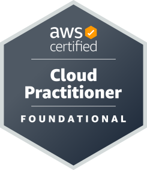
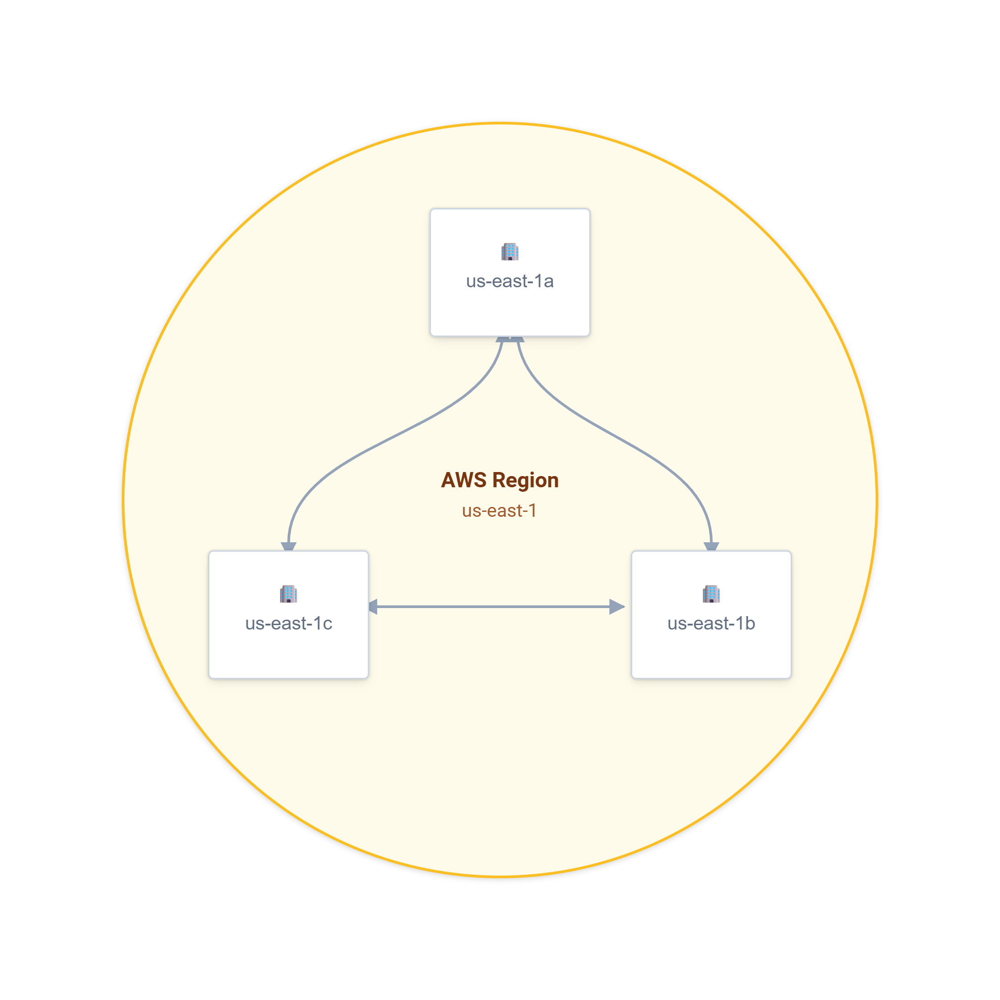
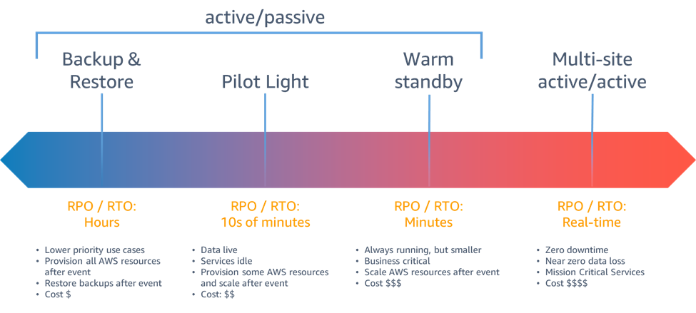
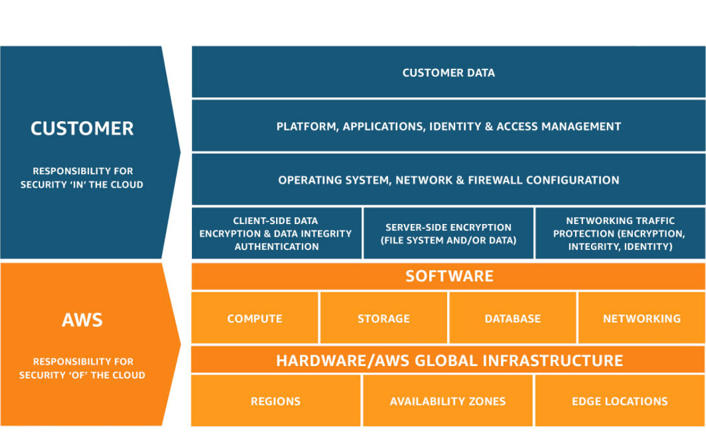
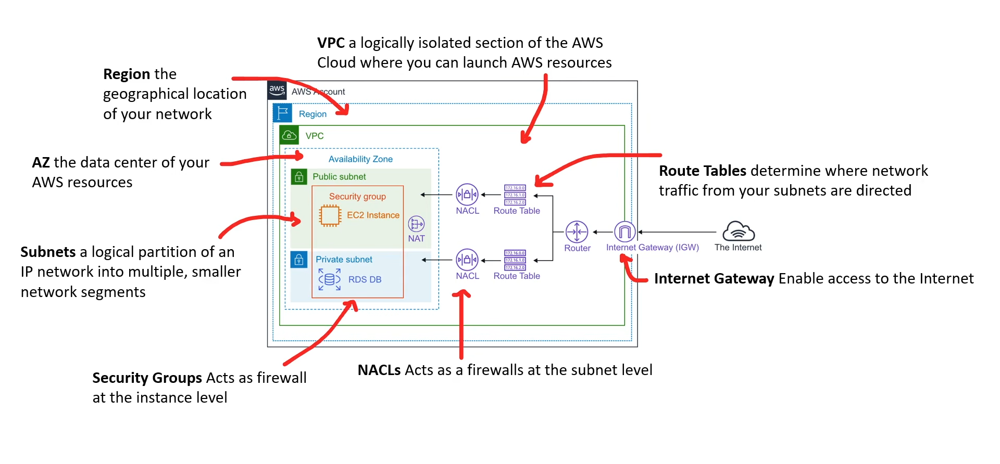

  

# AWS Certified Cloud Practitioner (CLF-C02): Complete Study Guide

This is my full exam preparation cheat sheet for 2026. Practice it with some practice exams to finalise your preparation. Structure: exam overview → Domain 1-4 sections → service comparison tables → pricing/billing breakdown → glossary → final cheat sheet.

---

## EXAM OVERVIEW

| Detail | Value |
|---|---|
| Exam code | CLF-C02 |
| Format | 65 questions (multiple choice / multiple response) |
| Time | 90 minutes |
| Passing score | 700 / 1000 (scaled scoring) |
| Cost | 100 USD |
| Domains | 4 |

**Domain Weighting (memorize this, it tells you where to spend study time):**

| Domain | Weight |
|---|---|
| 1. Cloud Concepts | 24% |
| 2. Security and Compliance | 30% |
| 3. Cloud Technology and Services | 34% |
| 4. Billing, Pricing, and Support | 12% |

**Takeaway:** Domains 2 and 3 together are nearly two-thirds of the exam. If you only have time to deeply study two domains tonight, make it those two, but do not skip Billing/Support, since it is heavily concentrated in a small number of memorizable facts (support tiers, pricing models, billing tools) that are easy points.

---

#  &nbsp;DOMAIN 1: CLOUD CONCEPTS (24%)

### 1.1 What is Cloud Computing?
The on-demand delivery of IT resources (compute, storage, databases, networking, analytics, etc.) over the internet with pay-as-you-go pricing, instead of buying, owning, and maintaining physical data centers and servers.

### 1.2 The Six Advantages of Cloud Computing (memorize verbatim)
1. **Trade capital expense for variable expense**: pay only when you consume resources, instead of investing heavily in data centers before knowing how they'll be used.
2. **Benefit from massive economies of scale**: AWS aggregates usage from hundreds of thousands of customers, achieving higher economies of scale, which translates into lower pay-as-you-go prices.
3. **Stop guessing capacity**: eliminate guessing infrastructure capacity needs; scale up or down as required, automatically.
4. **Increase speed and agility**: new IT resources are available in minutes instead of weeks.
5. **Stop spending money running and maintaining data centers**: focus on projects that differentiate your business, not infrastructure.
6. **Go global in minutes**: deploy applications in multiple Regions around the world with a few clicks, providing lower latency and a better experience for customers at minimal cost.

### 1.3 Deployment Models
- **Cloud-based deployment**: all application components run in the cloud.
- **On-premises deployment** (private cloud), resources deployed on-premises using virtualization/resource management tools.
- **Hybrid deployment**: connects cloud-based resources to on-premises infrastructure (common during migration or for compliance/latency reasons).

### 1.4 Service Models (IaaS / PaaS / SaaS)

| Model | Customer manages | AWS manages | Example |
|---|---|---|---|
| **IaaS** | OS, runtime, applications, data | Virtualization, servers, storage, networking | Amazon EC2 |
| **PaaS** | Applications, data | OS, runtime, middleware, virtualization, servers, storage, networking | AWS Elastic Beanstalk |
| **SaaS** | Just usage/data input | Everything else | Amazon Chime, WorkMail |

### 1.5 AWS Global Infrastructure

| Component | Definition |
|---|---|
| **Region** | A physical geographic location with multiple, isolated Availability Zones (e.g., us-east-1) |
| **Availability Zone (AZ)** | One or more discrete data centers with redundant power/networking, isolated from failures in other AZs within the same Region. Most Regions have 3+ AZs |
| **Edge Location** | A site used by CloudFront/Route 53 to cache content and route requests closer to end users, reduces latency, NOT for hosting EC2/RDS |
| **Local Zone** | An extension of a Region placed closer to large population/industry centers, for single-digit millisecond latency to end users in that area |
| **Wavelength Zone** | AWS infrastructure embedded within telecom providers' 5G networks for ultra-low-latency applications |
| **Regional Edge Cache** | A larger CloudFront cache tier between origin servers and edge locations, holding content longer |

**Why multiple Regions/AZs matter:** Fault tolerance, disaster recovery, data residency/compliance, and reduced latency for global users.

### 1.6 AWS Well-Architected Framework, Six Pillars (memorize all six)
1. **Operational Excellence**: run and monitor systems to deliver business value; continually improve processes.
2. **Security**: protect data, systems, and assets through risk assessment and mitigation.
3. **Reliability**: ability of a workload to perform its function correctly and consistently, recover quickly from failure.
4. **Performance Efficiency**: use computing resources efficiently and maintain that efficiency as demand changes.
5. **Cost Optimization**: avoid unnecessary costs, understand spending over time, select the right resource types/quantities.
6. **Sustainability** *(new vs. CLF-C01, high test priority)*: minimize environmental impacts of running cloud workloads (energy efficiency, reducing resource usage, supporting renewable energy).

### 1.7 Cloud Economics Concepts
- **TCO (Total Cost of Ownership)**: comparison of on-premises costs (hardware, facilities, power, cooling, staffing, opportunity cost) vs. cloud costs; AWS provides a TCO calculator.
- **CapEx vs. OpEx**: capital expenditure (upfront, fixed asset purchase) vs. operational expenditure (ongoing, pay-as-you-go); cloud shifts spend from CapEx to OpEx.
- **Elasticity**: automatically scaling resources up/down to match demand.
- **Agility**: ability to rapidly develop, test, and launch software applications.
- **High Availability**: designing systems to remain operational with minimal downtime (e.g., Multi-AZ deployments).
- **Fault Tolerance**: the built-in redundancy that allows a system to continue operating despite component failure.
- **Scalability**: vertical (bigger instance) vs. horizontal (more instances) scaling.
- **Disaster Recovery (DR) strategies** (know these four, in increasing cost/complexity order): Backup and Restore → Pilot Light → Warm Standby → Multi-site Active/Active.

---

#  &nbsp;DOMAIN 2: SECURITY AND COMPLIANCE (30%, highest weight)

### 2.1 AWS Shared Responsibility Model
- **AWS responsibility = "Security OF the cloud"**: physical infrastructure, hardware, global network, hypervisor/virtualization layer, host operating system, facilities.
- **Customer responsibility = "Security IN the cloud"**: guest OS patching (for IaaS), firewall/security group configuration, IAM management, data encryption, network traffic protection, client-side data, application-level security.
- **The split shifts depending on service abstraction level**: For EC2 (IaaS), the customer manages more (guest OS, patching). For RDS/Lambda (managed/serverless), AWS manages more, but the customer is STILL always responsible for access configuration, data classification, and credentials, this responsibility never disappears.

###  &nbsp;2.2 IAM (Identity and Access Management)
- **Root user**: created with the account; has unrestricted access. Best practice: enable MFA immediately, lock away credentials, do not use for daily tasks.
- **IAM Users**: individual identities with long-term credentials (username/password and/or access keys).
- **IAM Groups**: collections of users sharing the same permissions.
- **IAM Roles**: temporary credentials assumable by users, applications, or AWS services (e.g., EC2 instance role, Lambda execution role), preferred over long-term credentials for AWS services.
- **IAM Policies**: JSON documents defining permissions; can be identity-based (attached to user/group/role) or resource-based (attached directly to a resource like an S3 bucket policy, allowing cross-account access grants).
- **Principle of Least Privilege**: grant only the permissions required to perform a task, nothing more.
- **MFA (Multi-Factor Authentication)**: adds a second verification factor beyond username/password.
-  &nbsp;**IAM Identity Center** (formerly AWS SSO), centralized workforce identity/single sign-on across multiple AWS accounts and business applications.

### 2.3 Compliance and Governance Services

| Service | Purpose |
|---|---|
|  &nbsp;**AWS Artifact** | Self-service portal for compliance reports (SOC, PCI, ISO) and agreements (e.g., BAA for HIPAA) |
|  &nbsp;**AWS Config** | Tracks resource configuration changes over time; evaluates compliance against defined rules |
|  &nbsp;**AWS CloudTrail** | Logs and audits API calls / account activity ("who did what, when"), Event History enabled by default (90 days, free); create a Trail for long-term/multi-Region/data event logging |
|  &nbsp;**AWS Organizations** | Centrally manage multiple accounts; apply Service Control Policies (SCPs) as permission guardrails; enables Consolidated Billing |
|  &nbsp;**AWS Control Tower** | Automates setup of a secure, governed multi-account environment ("landing zone") using Organizations, IAM Identity Center, and Config under the hood |
|  &nbsp;**AWS Audit Manager** | Continuously audits AWS usage to simplify risk/compliance assessment against frameworks/regulations |

### 2.4 Security and Threat Detection Services

| Service | Purpose | Layer/Type |
|---|---|---|
|  &nbsp;**AWS Shield Standard** | Free, automatic DDoS protection for all customers | Network/Transport (L3/L4) |
|  &nbsp;**AWS Shield Advanced** | Paid, enhanced DDoS protection with 24/7 Shield Response Team (SRT) access and cost protection | Network/Transport (L3/L4) |
|  &nbsp;**AWS WAF** | Protects web applications against common exploits (SQL injection, XSS) via custom or managed rules | Application (L7) |
|  &nbsp;**Amazon GuardDuty** | ML-based threat detection; analyzes CloudTrail, VPC Flow Logs, DNS logs for malicious/anomalous activity | Detection |
|  &nbsp;**Amazon Macie** | Discovers, classifies, and protects sensitive data (e.g., PII) stored in S3 using ML | Data discovery |
|  &nbsp;**Amazon Inspector** | Automated vulnerability assessment for EC2 instances and container images | Vulnerability scanning |
|  &nbsp;**Amazon Detective** | Investigates and analyzes security findings to identify root cause | Investigation |
|  &nbsp;**AWS Secrets Manager** | Stores, manages, and automatically rotates secrets (DB credentials, API keys) | Secrets management |
|  &nbsp;**AWS KMS (Key Management Service)** | Create and manage cryptographic keys for encryption across AWS services | Encryption |
|  &nbsp;**AWS Certificate Manager (ACM)** | Provision, manage, and deploy free SSL/TLS certificates | Encryption in transit |

**Exam-critical distinction:** Shield = DDoS (network layer). WAF = application exploits (layer 7). Many questions hinge on identifying the attack type described.

### 2.5 Network Security
- **Security Groups**: virtual firewall at the instance/ENI level; **stateful**; **ALLOW rules only** (cannot explicitly deny).
- **Network ACLs (NACLs)**: operate at the subnet level; **stateless**; support both **ALLOW and DENY** rules, evaluated in numbered order.
- **VPC (Virtual Private Cloud)**: logically isolated section of the AWS Cloud where you launch resources in a virtual network you define.
- **Internet Gateway**: enables communication between a VPC and the internet.
- **NAT Gateway**: allows instances in a private subnet to access the internet (outbound) without being directly reachable from it (inbound).
- **VPC Peering**: connects two VPCs to route traffic between them privately.
-  &nbsp;**AWS Direct Connect**: dedicated, private physical network connection between on-premises and AWS (bypasses public internet, more consistent performance).
-  &nbsp;**AWS Site-to-Site VPN**: encrypted connection over the public internet between on-premises and AWS.
-  &nbsp;**AWS Transit Gateway**: central hub connecting multiple VPCs and on-premises networks.

### 2.6 Encryption Concepts
- **Encryption at rest**: protecting stored data (e.g., S3 default SSE-S3, EBS encryption, RDS encryption).
- **Encryption in transit**: protecting data moving across networks (e.g., TLS/SSL via ACM).
- Customer is always responsible for choosing the right encryption strategy and key management approach (e.g., SSE-KMS with customer-managed keys vs. default).

---

#  &nbsp;DOMAIN 3: CLOUD TECHNOLOGY AND SERVICES (34%, largest weight)

###  &nbsp;3.1 Compute Services

| Service | Type | Use Case |
|---|---|---|
|  &nbsp;**Amazon EC2** | IaaS virtual servers | Full control over OS; general-purpose, "lift-and-shift" migrations |
|  &nbsp;**AWS Lambda** | Serverless, event-driven functions | Run code in response to triggers; pay per request + duration; no server management |
|  &nbsp;**Amazon ECS** | Container orchestration | Run Docker containers; can use EC2 or Fargate launch type |
|  &nbsp;**Amazon EKS** | Managed Kubernetes | Run Kubernetes workloads on AWS |
|  &nbsp;**AWS Fargate** | Serverless compute engine for containers | Used with ECS/EKS; no EC2 instances to manage |
|  &nbsp;**AWS Elastic Beanstalk** | PaaS | Deploy and scale web apps without managing infrastructure details |
|  &nbsp;**Amazon Lightsail** | Simplified VPS | Easy-to-use virtual private servers for simple workloads/websites |
|  &nbsp;**AWS Batch** | Batch computing | Run large-scale batch jobs efficiently |
|  &nbsp;**AWS Outposts** | Hybrid | Run AWS infrastructure and services on-premises |

**EC2 Pricing Options:**
- **On-Demand**: pay per second/hour, no commitment, highest unit cost.
- **Reserved Instances (RI)**: 1 or 3-year commitment for a discount (up to ~72%); Standard RI (less flexible, deeper discount) vs. Convertible RI (can change instance family, slightly less discount).
-  &nbsp;**Savings Plans**: commit to a $/hour spend for 1 or 3 years; more flexible across instance families/Regions than Standard RIs (Compute Savings Plans) or services (EC2 Instance Savings Plans).
- **Spot Instances**: spare capacity at up to 90% discount; can be interrupted with 2-minute warning; only for fault-tolerant/flexible workloads.
- **Dedicated Hosts/Instances**: physical server dedicated to you, for licensing or compliance needs.
- **Capacity Reservations**: reserve capacity in a specific AZ, billed at On-Demand rate (no discount, just guaranteed availability).

**Scaling and Load Balancing:**
-  &nbsp;**EC2 Auto Scaling**: automatically adjusts the number of instances based on demand/policies/schedules.
-  &nbsp;**Elastic Load Balancing (ELB)**: distributes incoming traffic across multiple targets (Application Load Balancer for HTTP/HTTPS L7, Network Load Balancer for high-performance TCP/UDP L4, Gateway Load Balancer for third-party virtual appliances).

###  &nbsp;3.2 Storage Services

| Service | Type | Use Case |
|---|---|---|
|  &nbsp;**Amazon S3** | Object storage | Durable (11 nines), scalable storage for any amount of data |
|  &nbsp;**Amazon EBS** | Block storage | Persistent storage volumes attached to a single EC2 instance |
|  &nbsp;**Amazon EFS** | File storage (NFS) | Shared file system accessible by multiple EC2 instances simultaneously |
|  &nbsp;**Amazon FSx** | Managed file systems | Windows File Server or Lustre-compatible managed file storage |
|  &nbsp;**AWS Storage Gateway** | Hybrid storage | Connects on-premises environments to AWS cloud storage |
|  &nbsp;**AWS Snow Family** | Offline data transfer | Physical devices (Snowcone, Snowball, Snowmobile) for bandwidth-constrained, large-scale data migration |

**S3 Storage Classes (cost/retrieval-time hierarchy, most to least expensive):**
1. S3 Standard, frequently accessed data
2. S3 Intelligent-Tiering, automatically moves objects between tiers based on access patterns
3. S3 Standard-IA (Infrequently Accessed), millisecond access, lower storage cost, retrieval fee
4. S3 One Zone-IA, same as Standard-IA but stored in only one AZ (cheaper, less resilient)
5. S3 Glacier Instant Retrieval, archive data needing millisecond access
6. S3 Glacier Flexible Retrieval, archive, retrieval in minutes to hours
7. S3 Glacier Deep Archive, lowest cost, retrieval in hours; long-term compliance archives

**Key S3 metrics:** Durability = 99.999999999% (11 nines), won't lose data. Availability = 99.99% (S3 Standard), can access it when needed. **These are NOT the same thing.**

###  &nbsp;3.3 Database Services

| Service | Type | Use Case |
|---|---|---|
|  &nbsp;**Amazon RDS** | Managed relational DB | MySQL, PostgreSQL, MariaDB, Oracle, SQL Server; AWS handles patching/backups, optional Multi-AZ for failover |
|  &nbsp;**Amazon Aurora** | Managed relational DB | MySQL/PostgreSQL-compatible; up to 5x MySQL throughput; high availability built in |
|  &nbsp;**Amazon DynamoDB** | NoSQL (key-value/document) | Serverless, single-digit millisecond performance at any scale |
|  &nbsp;**Amazon Redshift** | Data warehouse | Large-scale analytics/OLAP queries across massive datasets |
|  &nbsp;**Amazon ElastiCache** | In-memory caching | Redis or Memcached-compatible; speeds up application performance |
|  &nbsp;**Amazon Neptune** | Graph database | Highly connected data (social networks, recommendation engines) |
|  &nbsp;**Amazon DocumentDB** | Document database | MongoDB-compatible |
|  &nbsp;**AWS Database Migration Service (DMS)** | Migration | Migrate databases to AWS with minimal downtime |

###  &nbsp;3.4 Networking and Content Delivery

| Service | Purpose |
|---|---|
|  &nbsp;**Amazon VPC** | Isolated virtual network for your resources |
|  &nbsp;**Amazon Route 53** | Scalable DNS, domain registration, health checking, traffic routing policies |
|  &nbsp;**Amazon CloudFront** | CDN, caches content (HTTP/HTTPS) at edge locations to reduce latency |
|  &nbsp;**AWS Global Accelerator** | Improves availability/performance for TCP/UDP traffic via the AWS global network (non-HTTP-specific, e.g., gaming, VoIP) |
|  &nbsp;**AWS Direct Connect** | Dedicated private network link to AWS |
|  &nbsp;**Elastic Load Balancing** | Distributes traffic across multiple targets |

**CloudFront vs. Global Accelerator:** CloudFront = caches HTTP/HTTPS content. Global Accelerator = routes any TCP/UDP traffic over AWS's backbone network, no caching involved.

###  &nbsp;3.5 Messaging and Integration

| Service | Pattern | Use Case |
|---|---|---|
|  &nbsp;**Amazon SQS** | Queue (pull-based) | Decouples microservices; messages persist until processed/deleted; prevents message loss |
|  &nbsp;**Amazon SNS** | Pub/Sub (push-based) | Fan-out a single message to multiple subscriber endpoints (email, SMS, Lambda, etc.) simultaneously |
|  &nbsp;**Amazon EventBridge** | Event bus / routing | Filters and routes events from AWS services, SaaS apps, and custom sources based on content rules |
|  &nbsp;**AWS Step Functions** | Workflow orchestration | Coordinates multiple AWS services into serverless workflows/state machines |
|  &nbsp;**Amazon API Gateway** | API management | Create, publish, and manage REST/WebSocket/HTTP APIs at scale |
|  &nbsp;**Amazon SES** | Email sending/receiving | Transactional and marketing email |
|  &nbsp;**Amazon MQ** | Managed message broker | Supports Apache ActiveMQ/RabbitMQ for migrating existing message broker apps |

###  &nbsp;3.6 Management, Monitoring, and Developer Tools

| Service | Purpose |
|---|---|
|  &nbsp;**Amazon CloudWatch** | Monitors performance metrics, collects logs, sets alarms |
|  &nbsp;**AWS CloudTrail** | Logs API/account activity for auditing |
|  &nbsp;**AWS Config** | Tracks resource configuration and compliance over time |
|  &nbsp;**AWS Trusted Advisor** | Real-time best-practice recommendations across cost, performance, security, fault tolerance, service limits |
|  &nbsp;**AWS CloudFormation** | Infrastructure as Code, provision resources via JSON/YAML templates |
|  &nbsp;**AWS Systems Manager** | Operational management, patching, automation, parameter storage, session management |
| **AWS OpsWorks** | Configuration management using Chef/Puppet |
|  &nbsp;**AWS X-Ray** | Analyze and debug distributed applications (trace requests) |
|  &nbsp;**AWS Personal Health Dashboard** | Alerts about AWS events affecting YOUR specific resources (vs. the public AWS Service Health Dashboard, which shows overall service status for everyone) |

###  &nbsp;3.7 Migration and Transfer
-  &nbsp;**AWS Snow Family**: offline transfer for large/bandwidth-constrained data.
-  &nbsp;**AWS DataSync**: automates online data transfer between on-premises and AWS.
-  &nbsp;**AWS Application Discovery Service**: discovers on-premises servers/workloads to plan migration.
-  &nbsp;**AWS Migration Evaluator**: estimates cost savings of migrating to AWS (business case building).
- **The "6 R's" of Migration:** Rehost (lift-and-shift, e.g., EC2), Replatform, Repurchase (move to SaaS), Refactor (re-architect), Retire, Retain.

###  &nbsp;3.8 Analytics and AI/ML (light coverage, but appears)
-  &nbsp;**Amazon Athena**: serverless SQL queries directly against S3 data.
- **Amazon QuickSight**: business intelligence/dashboarding.
-  &nbsp;**AWS Glue**: serverless data integration/ETL.
-  &nbsp;**Amazon Kinesis**: real-time data streaming.
-  &nbsp;**Amazon SageMaker**: build, train, and deploy machine learning models.
-  &nbsp; &nbsp; &nbsp; &nbsp; &nbsp;**Amazon Comprehend / Rekognition / Transcribe / Polly / Translate**: pre-built AI services for NLP, image/video analysis, speech-to-text, text-to-speech, translation.

---

#  &nbsp;DOMAIN 4: BILLING, PRICING, AND SUPPORT (12%)

### 4.1 Pricing Fundamentals
AWS pricing is based on three fundamental drivers: **Compute, Storage, and Data Transfer OUT** (data transfer IN is generally free).

### 4.2 Billing and Cost Management Tools

| Tool | Purpose |
|---|---|
| **AWS Pricing Calculator** | Estimate costs BEFORE deployment, based on a planned architecture |
|  &nbsp;**AWS Cost Explorer** | Visualize historical spending patterns AND forecast future costs |
|  &nbsp;**AWS Budgets** | Set custom cost/usage/RI/Savings Plan thresholds; sends alerts when actual or forecasted spend exceeds them |
|  &nbsp;**AWS Cost and Usage Report (CUR)** | Most detailed, granular billing data export available |
| **Cost Allocation Tags** | Tag resources to break down costs by department/project/environment |
|  &nbsp;**AWS Billing Conductor** | Customize billing data presentation, often used by resellers/MSPs |
| **Consolidated Billing (via Organizations)** | One bill for all member accounts; enables pooled volume discounts |

### 4.3 AWS Free Tier, Three Types
1. **Always Free**: available indefinitely to all customers (e.g., limited Lambda invocations).
2. **12 Months Free**: free usage amounts starting from account creation date, for the first 12 months only.
3. **Trials**: short-term free offers starting from the date you first use a specific service.

###  &nbsp;4.4 AWS Support Plans

| Plan | Cost | Response Time (Critical) | Key Features |
|---|---|---|---|
| **Basic** | Free | No SLA | Personal Health Dashboard, limited Trusted Advisor checks, documentation/forums, billing/account support |
| **Developer** | From $29/mo | <24h general guidance / <12h system impaired | Business hours email support, no "business-critical" tier |
| **Business** | From $100/mo | <1 hour (business-critical system down) | 24/7 phone/chat/email, full Trusted Advisor checks, API access for support cases |
| **Enterprise On-Ramp** | From $5,500/mo | <30 min (business-critical) | Pooled Cloud Advisor access (TAM-lite), concierge support team |
| **Enterprise** | From $15,000/mo | <15 min (business-critical) | Dedicated Technical Account Manager (TAM), proactive guidance, Concierge Support |

**Memorize the response-time SLA pattern: Basic = none, Developer = hours, Business = 1 hour, Enterprise On-Ramp = 30 min, Enterprise = 15 min.**

### 4.5 Marketplace and Procurement
-  &nbsp;**AWS Marketplace**: curated digital catalog of third-party software that runs on AWS, billed through your AWS account.
-  &nbsp;**AWS Organizations + Consolidated Billing**: single bill across linked accounts, volume discount pooling.

---

## CRITICAL SERVICE COMPARISON CHEAT SHEET

| Comparison | Key Distinction |
|---|---|
| Security Group vs. NACL | SG = stateful, instance-level, allow only. NACL = stateless, subnet-level, allow + deny |
| CloudTrail vs. CloudWatch vs. Config vs. GuardDuty | CloudTrail = logs WHO did WHAT (API audit). CloudWatch = monitors performance/metrics/logs/alarms. Config = tracks configuration state/compliance over time. GuardDuty = ML-based threat detection |
| SNS vs. SQS vs. EventBridge | SNS = push/fan-out pub-sub. SQS = pull-based queue, persists messages. EventBridge = content-based event routing/filtering across many sources |
| RDS vs. Aurora vs. DynamoDB vs. Redshift | RDS = managed relational (standard engines). Aurora = AWS's enhanced MySQL/PostgreSQL-compatible engine. DynamoDB = NoSQL key-value/document. Redshift = data warehouse/analytics (OLAP) |
| CloudFront vs. Global Accelerator | CloudFront = HTTP/HTTPS caching CDN. Global Accelerator = TCP/UDP network-layer routing (no caching) |
| Shield vs. WAF | Shield = DDoS (network/transport layer). WAF = application exploits like SQLi/XSS (layer 7) |
| Organizations vs. Control Tower | Organizations = account management/SCPs/consolidated billing (the underlying mechanism). Control Tower = automated landing zone setup built ON TOP of Organizations |
| Durability vs. Availability | Durability = won't lose the data (S3 = 11 nines). Availability = can access it when needed (S3 Standard = 99.99%) |
| Vertical vs. Horizontal Scaling | Vertical = bigger instance (scale up). Horizontal = more instances (scale out) |
| Standard RI vs. Convertible RI vs. Savings Plans vs. Spot | Standard RI = cheapest but least flexible. Convertible RI = can change instance family. Savings Plans = $/hour commitment, flexible across families/services. Spot = deepest discount, interruptible only |
| Cost Explorer vs. Budgets vs. Pricing Calculator | Cost Explorer = visualize/forecast EXISTING spend. Budgets = alert when thresholds crossed. Pricing Calculator = estimate cost BEFORE deployment |
| Trusted Advisor vs. Artifact | Trusted Advisor = best-practice recommendations (cost/security/performance/fault tolerance/limits). Artifact = compliance reports and agreements (SOC, PCI, BAA) |

---

## GLOSSARY OF MUST-KNOW TERMS

- **API (Application Programming Interface)**: interface allowing programs to communicate.
- **Auto Scaling**: automatic adjustment of compute resources to match demand.
- **CIDR block**: range of IP addresses for a VPC/subnet.
- **Consolidated Billing**: single bill across an AWS Organization.
- **Edge Location**: caching/DNS site closest to end users.
- **Elasticity**: automatic scaling up/down with demand.
- **Endpoint**: URL entry point for a web service.
- **Fault Tolerance**: system continues operating despite component failure.
- **High Availability**: system designed for minimal downtime.
- **Idempotency**: operation that produces the same result no matter how many times it's performed.
- **Latency**: time delay between request and response.
- **Managed Service**: AWS handles operational overhead (patching, scaling, backups).
- **Multi-AZ**: deployment spanning multiple Availability Zones for resilience.
- **Multi-tenancy**: multiple customers sharing underlying infrastructure with logical isolation.
- **Resource**: an entity you can work with in AWS (instance, bucket, table, etc.)
- **Scalability**: ability to increase/decrease resource capacity as needed.
- **SLA (Service Level Agreement)**: AWS's commitment to a level of service (e.g., uptime percentage).
- **Serverless**: no server provisioning/management required by the customer (Lambda, Fargate, DynamoDB on-demand).

---
